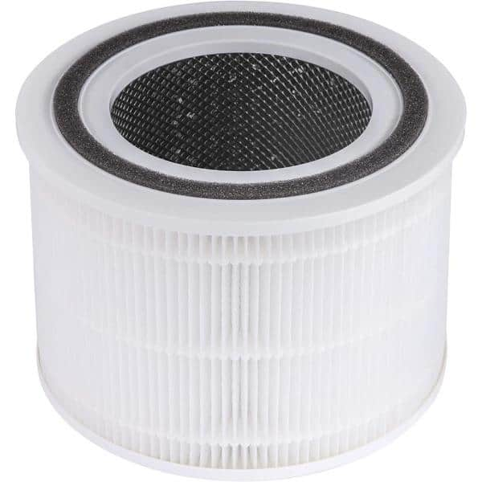
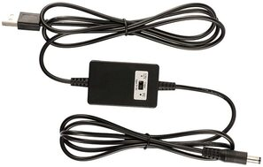
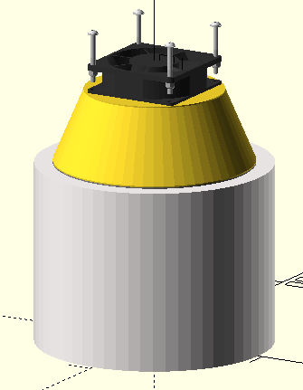

+++
title = "DIY Air Purifier"
date = 2022-02-09T22:30:43-08:00
description = "A basic air purifier made with an off the shelf HEPA filter."
[taxonomies]
tags = ["hardware", "cad", "3dprinting"]
+++

After the recent [air stagnation advisory in West Washington](https://www.kuow.org/stories/air-stagnation-advisory-washington-january-2022),
I was interested in improving indoor air quality in my home. Big Clive's video [DIY cheap & quiet HEPA air cleaner](https://www.youtube.com/watch?v=6Vmh2Ip2Vxg) gave me the inspiration I needed to get started on my own air purifier.

## Parts

All I needed was a filter and a fan to attach it to. For the filter: a [VortexAir True HEPA Filter](https://www.homedepot.com/p/LEVOIT-VortexAir-True-HEPA-Replacement-Filter-HEACAFLVNUS0012/317963268) from Home Depot. For the fan: a spare case fan in my closet from a [past PC upgrade](@/blog/dell_optiplex_upgrade/index.md).

*VortexAir True HEPA Filter*

*Noctua NF A-8 PWM Fan*

I soon realized there were a few parts I hadn't thought about -- the fan needed a power supply, and it didn't make a seal with the filter so I needed to make some kind of adapter.

Luckily, I happened to have a USB 5V to 12V DC converter on hand which fit the bill.

With my novice [OpenSCAD](https://openscad.org) skills, I modeled and 3D printed an adapter to mount the fan on top of the filter.
Air is sucked through the filter's fins, up, and out the top.

## Bearings

Big Clive's video discusses one major concern with running case fans in this orientation: bearings.
Common case fans use steel ball bearings to run smoothly and efficiently.
However, this is a major shortcoming for the air purifier design.
The orientation of the fan means the fan blade weighs down on the bearings in a way they weren't designed for.
So the lifetime of a fan with steel ball bearings would be severely reduced.
Thankfully I was in the clear on this -- the fan I used has a special ["SSO2" bearing](https://noctua.at/en/sso2-bearing) that is hydrodynamic and stabilized by a magnetic field.
Friction is greatly reduced in this environment so orientation does not significantly affect the fan's lifetime.

## Final Product

And for the finished air purifier:

The parts used:
* [VortexAir True HEPA Filter](https://www.homedepot.com/p/LEVOIT-VortexAir-True-HEPA-Replacement-Filter-HEACAFLVNUS0012/317963268): $30
* [Noctua NF-A8 PWM Fan](https://noctua.at/en/nf-a8-pwm): $20
* [5V to 12V USB Boost Converter](https://www.amazon.com/gp/product/B01AY3XLEY/): $9
* USB-A Wall charger: free
* 3D printed adapter: $2.84 materials cost

The total cost was $61.84. This is $38.15 cheaper than the filter's [namesake air purifier](https://www.homedepot.com/p/LEVOIT-VortexAir-True-HEPA-Air-Purifier-220-Sq-Ft-HEAPAPLVNUS0017/317951088) and was a fun project.