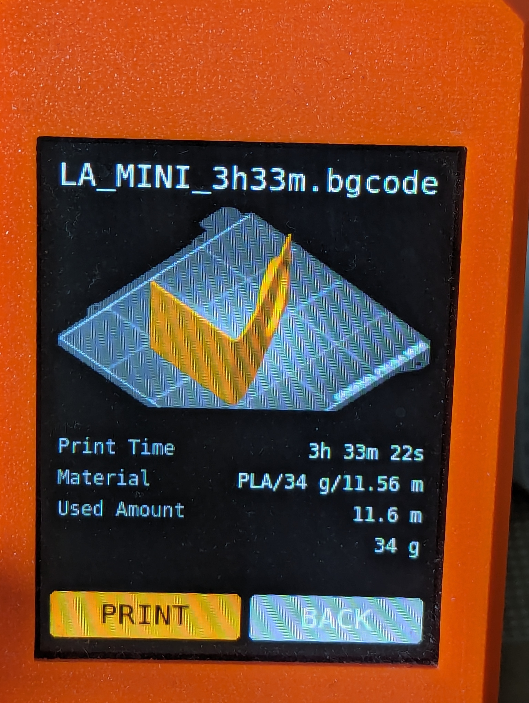

+++
title = "Binary G-code"
date = 2024-05-22T23:06:51-07:00
description = "How it works and why it is useful"
[taxonomies]
tags = ["g-code", "compression"]
+++

This post is the first in a series I am making about [binary G-code](https://help.prusa3d.com/article/binary-g-code_646763): a compressed format for [G-code](https://en.wikipedia.org/wiki/G-code) released by [Prusa Research](https://www.prusa3d.com/).
They claim a 70% size reduction on average while maintaining a low CPU/memory footprint. This is a _pretty big deal_ for 3D printing and CNC in general.

## Motivation

G-Code in plaintext ASCII is great for reading/editing, but problematic for the machines that have to run it. Most are powered by microcontrollers so they are quite limited in all dimensions -- CPU, memory, storage, and bandwidth. A good example is the [pen plotter](@/blog/pen_plotter/index.md) I built a few years back. It ran [grbl](https://github.com/grbl/grbl), an embedded CNC controller, on an [Arduino](https://docs.arduino.cc/learn/starting-guide/whats-arduino/) microcontroller. The plotter would receive G-code over a serial ([UART](https://en.wikipedia.org/wiki/Universal_asynchronous_receiver-transmitter)) interface and execute it on the fly.

There was an issue where the plotter would move at the desired feed rate when drawing lines, but stutter and move slowly when drawing curves. It turned out to be because [curves are interpolated](@/blog/svg2gcode_progress/index.md#circular-interpolation) as many small line segments. The G-code for curves was so verbose that the plotter could not receive instructions fast enough to execute them! Increasing the [Baud rate](https://en.wikipedia.org/wiki/Baud) for the serial interface fixed the stuttering. Though is not always an option and doesn't scale well for machines with tighter tolerances.

## Licensing

Before we talk about how binary G-code works, I want to touch on licensing. Prusa Research has made their library and format specification [available on GitHub](https://github.com/prusa3d/libbgcode/). However, the code is licensed under [AGPL](https://en.wikipedia.org/wiki/GNU_Affero_General_Public_License). Any project using this library must also make its source code available under AGPL. This aligns with [Prusa's stance on open source](https://blog.prusa3d.com/the-state-of-open-source-in-3d-printing-in-2023_76659/); everyone who builds on open contributions in the 3D printing community should contribute back. Licensing aside, it is clear that binary G-code has been designed with extensibility in mind and wider adoption is definitely encouraged.

## How it works

Now lets discuss the format and some of the cool details under the hood. According to the [specification](https://github.com/prusa3d/libbgcode/blob/main/doc/specifications.md), a binary G-code file consists of a file header followed by a series of blocks. The file header contains basic info like what version of binary G-code this is and whether blocks have checksums. There's also a [magic number](https://en.wikipedia.org/wiki/Magic_number_%28programming%29) at the beginning to indicate that the file is binary, not ASCII.

### Block compression

Each block consists of a header followed by data. The header has a field for the type of compression which is where things get interesting. The first type is [Deflate](https://en.wikipedia.org/wiki/Deflate). This is the same compression algorithm used for `.zip` archive files. While it is very effective and widely used, it is challenging to implement on a microcontroller. The library [zlib-deflate-nostdlib](https://github.com/derf/zlib-deflate-nostdlib?tab=readme-ov-file#memory-requirements) makes decompression possible though it is quite limited; the maximum decompressed data size is 32kB and all data must be processed at once. There are also vulnerabilities like [zip bombs](https://en.wikipedia.org/wiki/Zip_bomb) to guard against.

The other two compression types are variations of [Heatshrink](https://github.com/atomicobject/heatshrink/): a compression algorithm designed for embedded/real-time systems. It performs no heap allocations and works well in streaming applications. This is a perfect fit for binary G-code.

### Block types

There are 6 different block types: file metadata, printer metadata, thumbnail, print metadata, slicer metadata, and G-code. The blocks must appear in this exact order with some qualifications: file metadata is optional, there can be 0 or more thumbnails, and there can be more than one G-code block.

Metadata blocks all contain key-value pairs in [INI](https://en.wikipedia.org/wiki/INI_file) format. I'm not familiar with what these key-value pairs should be, but they could be used for all sorts of things like checking machine compatibility and displaying auxiliary info to the user.

### Thumbnail block

The thumbnail block is for embedding small images. [PrusaSlicer](https://www.prusa3d.com/en/page/prusaslicer_424/) adds a [model preview thumbnail](https://help.prusa3d.com/article/model-preview_648687) to be shown on 3D printers with graphical displays. In plaintext G-code, this was hacked in as a [Base64](https://en.wikipedia.org/wiki/Base64) encoded comment ([example](https://imgur.com/c7x9BQ7)).

Thumbnails can be encoded in common image formats like PNG and JPEG, but neither is suited for the application. PNGs use Deflate which, as discussed in [block compression](#block-compression), is hard to adapt to microcontrollers. JPEG decoding needs a fast inverse discrete cosine transform which is computationally intensive and it isn't efficient for small images. In late 2023, Prusa Research made a hard break from PNG to [QOI](https://en.wikipedia.org/wiki/QOI_%28image_format%29) (Quite OK Image Format) for thumbnails. QOI is very recent format announced in 2021. The author's goal was to create a lossless image format that is faster and easier to implement than PNG. This has proven to be true as the [decoder fits in less than 200 lines of code](https://github.com/prusa3d/Prusa-Firmware-Buddy/blob/991dd60247e0ee34ec3866558de6c3b46b124338/src/gui/qoi_decoder.cpp#L6) and uses no heap memory.

### G-code block

Finally we arrive at the block for G-code itself. It can be in plaintext ASCII or encoded with a variation of the [MeatPack algorithm](https://github.com/scottmudge/OctoPrint-MeatPack). MeatPack halves the size of G-code on average while using no additional memory aside from a static lookup table. As the author notes, this can reduce stuttering when transmitting G-code for on the fly execution. 

## What's next

I am actively working on incorporating binary G-code support into my [g-code for Rust](https://github.com/sameer/g-code) library. The end goal is to provide binary G-code output to [svg2gcode](https://github.com/sameer/svg2gcode) and provide a suite of tooling for working with G-code.

There are posts about Heatshrink, QOI, and MeatPack in the works so stay tuned!
