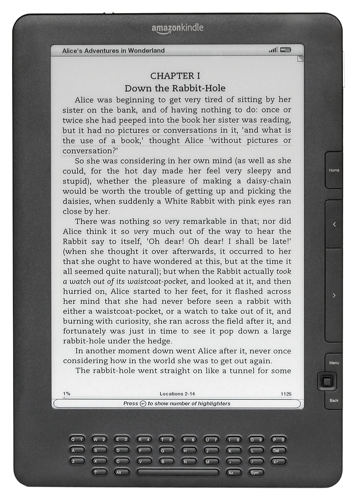
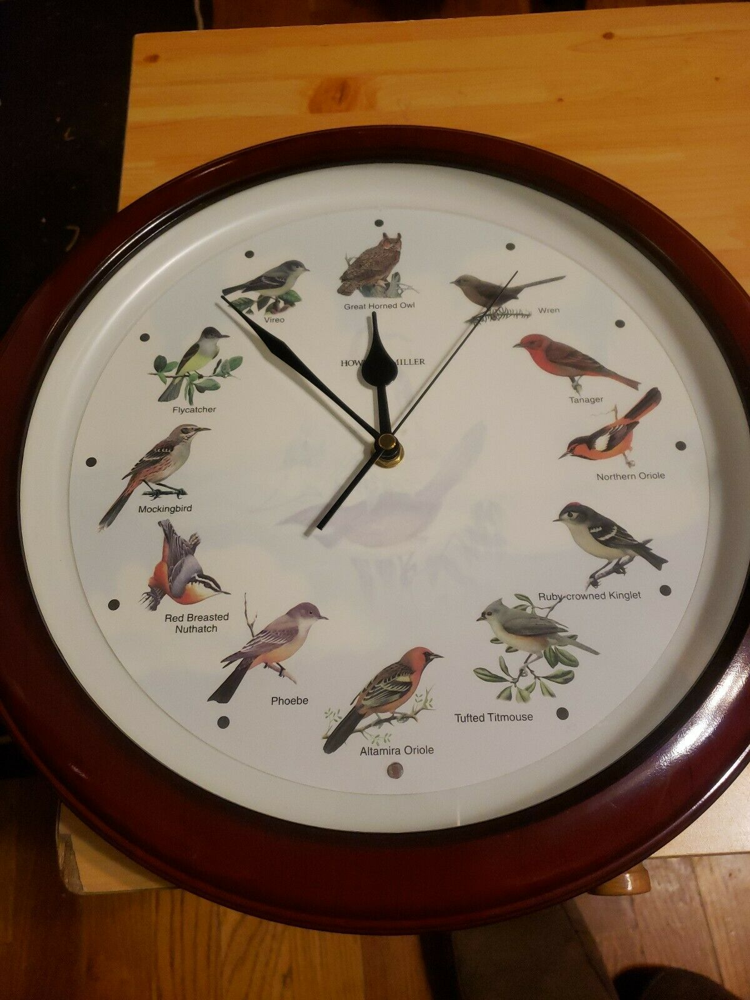
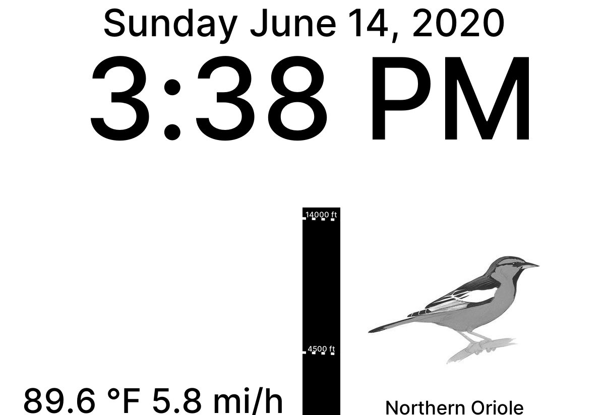
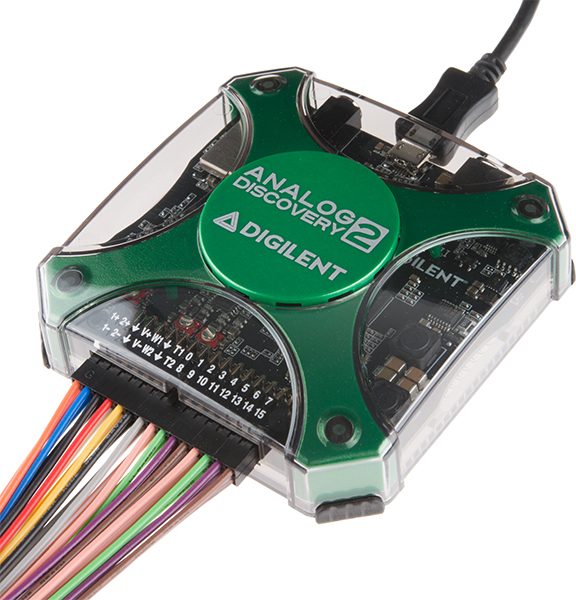
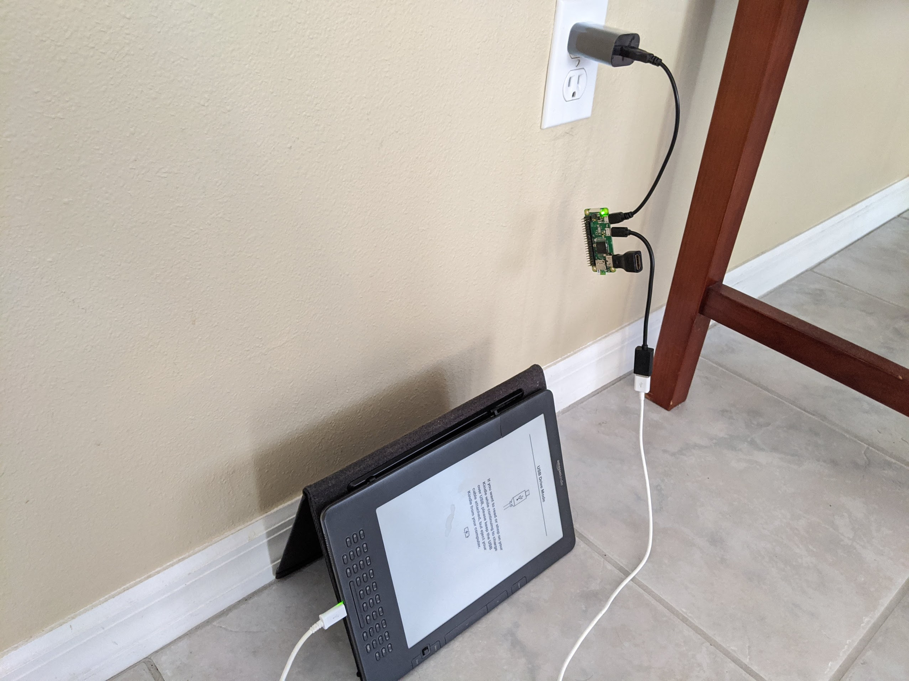

+++
title = "Kindle DX Graphite as an E Ink Clock"
date = 2020-06-14T12:28:00-04:00
+++

Last summer, I bought a used [Kindle DX Graphite](https://en.wikipedia.org/wiki/Amazon_Kindle#Kindle_DX_Graphite):


*User:Evan-Amos Public Domain, via Wikimedia Commons*

Originally released in 2010, the Kindle DX Graphite has a large 9.7" [E Ink Pearl](https://wiki.mobileread.com/wiki/E_Ink_Pearl) display, a full QWERTY keyboard, and audio playback capabilities.

I have an old Howard Miller Songbird clock that stopped working, so I decided to digitally recreate it on the Kindle.


*User:stevenmashbur_5, ebay*

Sample image from the clock:



The source code is [available on GitHub](https://github.com/sameer/eink-clock). Below, I've documented the process that led to the clock and how it works.

## Jailbreaking

The Kindle is locked down for reading and other predetermined purposes.
To free the device and customize it for my needs, I had to [jailbreak](https://en.wikipedia.org/wiki/IOS_jailbreaking) it.
NiLuJe and the other users over at MobileRead [have developed an easy, straightforward way to jailbreak Kindles](https://www.mobileread.com/forums/showthread.php?t=88004). All you have to do is download their self-signed update onto the Kindle and run the software update.

### USBNetwork

Unfortunately, the Kindle DX Graphite does not have WiFi. It uses a tiny 3G cellular data plan to register with and fetch content from Amazon. Now that it's jailbroken, it's possible to work around these limitations with the [USBNetwork hack](https://www.mobileread.com/forums/showthread.php?t=88004). It changes the USB interface from mass storage device to [RNDIS ethernet gadget](https://en.wikipedia.org/wiki/RNDIS). In simpler terms, instead of showing up like a flash drive, it'll be a device at the IP address `192.168.2.2` that you can [SSH](https://en.wikipedia.org/wiki/Secure_Shell) into.

After installing USBNetwork with a software update, I enabled it through the `sym` key search menu:

```bash
;debugOn
`usbNetwork
;debugOff
```

If you have a newer Kindle, `` `usbNetwork`` may be `~usbNetwork`

My computer recognized it as an ethernet device:

```
$ lsusb -v | grep Ethernet
Bus 002 Device 037: ID 0525:a4a2 Netchip Technology, Inc. Linux-USB Ethernet/RNDIS Gadget
```

It can be configured manually with [iproute2](https://en.wikipedia.org/wiki/Iproute2):

```bash
$ ip a add 192.168.2.1/24 dev usb0
$ ip link set dev usb0 up
```

And finally, success!
```
$ ssh root@192.168.2.2
root@192.168.2.2's password: 
#################################################
#  N O T I C E  *  N O T I C E  *  N O T I C E  # 
#################################################
Rootfs is mounted read-only. Invoke mntroot rw to
switch back to a writable rootfs.
#################################################
[root@kindle root]# 
```


## Major Setback

Most of the work so far was done last summer, but I ran into a setback that put the project into limbo.
I read [Yifan Lu's post about unofficially updating the Kindle from firmware v2.5.8 to v3.2.1](https://www.mobileread.com/forums/showthread.php?p=1473632) and decided to install it.
Newer is always better, right?

After installing v3.2.1, USBNetwork stopped working and I didn't know how to roll back the changes.
I abandoned the project and forgot about the Kindle.

### rootfs.img

Two weeks ago, I found the Kindle lying in a drawer and decided to pick up the project again.
Several users on the MobileRead forums [mentioned being stuck in a similar situation](https://www.mobileread.com/forums/showthread.php?t=243823). One said it was possible to roll back a Kindle if you made a backup of the Kindle's filesystem root, a `rootfs.img`.
I never made one, and couldn't find any online from other DX Graphite owners.
This was pretty disheartening and I was ready to give up on the project again.

Luckily I discovered a `rootfs.img` on the Kindle itself while browsing around the storage.
It turned out that Yifan Lu's unofficial updater made a backup of the system in v2.5.8!
I immediately transferred it to my computer just in case. If you need a copy, feel free to [contact me](https://purisa.me/about/) and I can send it to you.

### Serial console

Flashing the Kindle with the `rootfs.img` turned out to be more than I bargained for. Normally, only the user storage is exposed over USB.
I needed to use the [onboard serial console](https://www.mobileread.com/forums/showthread.php?t=49942) to open the recovery menu and enable access to the entire filesystem.


*User:ebs, MobileRead forums*

I didn't have a [USB to TTL UART converter](https://www.adafruit.com/product/954), but I was able to borrow my brother's [Digilent Analog Discovery 2](https://store.digilentinc.com/analog-discovery-2-100msps-usb-oscilloscope-logic-analyzer-and-variable-power-supply/) which supported UART:


*SparkFun Electronics, CC BY 2.0*

I rebooted the Kindle, pressed the `enter` key furiously from the console in [WaveForms](https://store.digilentinc.com/waveforms-download-only/), and success!

```
Menu
====
3. Load MMC0 over USB storage
4. Erase MMC0
I. Initialize Partition Table (fdisk) and format FAT
O. Format and overwrite FAT partition
E. Export FAT partition
U. Update using rootfs.img.gz or rootfs.img on FAT partition
Q. quit
Choose:  3
```

I [dd](https://linux.die.net/man/1/dd)'d the `rootfs.img` to the Kindle:

```bash
dd if=rootfs.img of=/dev/sdb bs=4M status=progress oflag=sync
```

Then it successfully booted with firmware v2.5.8.

## E Ink Clock

Now that things were set up, I started working on the clock itself.

### Hardware

To bring WiFi connectivity to the Kindle, I connected it to a [Raspberry Pi Zero W](https://www.raspberrypi.org/products/raspberry-pi-zero-w/) running [Arch Linux ARM](https://archlinuxarm.org/):



From the Pi, I could run a daemon that refreshes the Kindle every minute and plays a tune every hour.

### Built-in Software

#### eips

The MobileRead wiki mentions a special Kindle command, [eips](https://wiki.mobileread.com/wiki/Eips#Show_image), that lets you draw graphics to the Kindle screen. I originally planned to write directly to the frame buffer à la `dd of=/dev/fb0`, but `eips` has some special logic for partial screen updates that preserves the lifetime of the E Ink display. A full screen refresh 1,440 times a day is bound to wear out the screen faster than usual.

#### ALSA

For audio, [ALSA](https://en.wikipedia.org/wiki/Advanced_Linux_Sound_Architecture) is available on Linux. I found that the Kindle has the [aplay](https://linux.die.net/man/1/aplay) and [amixer](https://linux.die.net/man/1/amixer) commands.
This meant it could play [WAV files](https://en.wikipedia.org/wiki/WAV) and the volume could be controlled over SSH.

### Self-written Software

The next step was actually writing the daemon. I chose to write it in [Rust](https://www.rust-lang.org/), one of my favorite programming languages.
It's gone through several iterations and different libraries since I started writing it, so I'll describe it in its current state.

#### Systemd Timer

Instead of running in the background forever, [systemd](https://en.wikipedia.org/wiki/Systemd) runs the daemon every minute on a timer.
This way, a spurious error will not completely stop the clock from refreshing, and it could succeed again the next time it's triggered.

#### Networking

##### SSH

The daemon integrates [libssh2](https://www.libssh2.org/) to run the `eips`, `aplay`, and `amixer` commands.

The SSH timeout is set to one second. That way, the daemon can fail early if the Kindle is unavailable.
The latency over USBNetwork is pretty low, so one second is a reasonable upper limit on connection time:

```
$ ping 192.168.2.2 -c 4
PING 192.168.2.2 (192.168.2.2) 56(84) bytes of data.
64 bytes from 192.168.2.2: icmp_seq=1 ttl=64 time=0.511 ms
64 bytes from 192.168.2.2: icmp_seq=2 ttl=64 time=0.397 ms
64 bytes from 192.168.2.2: icmp_seq=3 ttl=64 time=0.422 ms
64 bytes from 192.168.2.2: icmp_seq=4 ttl=64 time=0.458 ms

--- 192.168.2.2 ping statistics ---
4 packets transmitted, 4 received, 0% packet loss, time 3087ms
rtt min/avg/max/mdev = 0.397/0.447/0.511/0.042 ms
```

##### iproute2

The process of manually adding the Kindle to networking is automated for better resiliency.
If the Kindle is disconnected or the power is reset, the daemon can run the iproute2 commands needed to configure networking using Corentin Henry's [rtnetlink library](https://github.com/little-dude/netlink).

#### Graphics

[Cairo](https://www.cairographics.org/) is used for 2D graphics. Text is rendered with the [Inter](https://github.com/rsms/inter) font and emojis with [OpenMoji](https://openmoji.org/). I experimented with SVG-based rendering using Evgeniy Reizner's [resvg](https://github.com/RazrFalcon/resvg), but SVGs are not a good tool for text layout.

As a replacement for the bird images I used David Allen Sibley's beautiful drawings of North American birds:


*Great Horned Owl, David Allen Sibley*

Because the Kindle only has 16 levels of grayscale, some of the artwork depth is lost.
This could be fixed with [e-ink graphics preprocessing](https://learn.adafruit.com/preparing-graphics-for-e-ink-displays?view=all), but I haven't gotten around to it.

#### Audio

I recorded the hourly bird sounds from the clock using [Audacity](https://www.audacityteam.org/) and cleaned them up with [SoX](https://github.com/chirlu/sox). Listen to the Great Horned Owl:

<audio controls src="12.wav">Your browser does not support audio playback.</audio>

To play them, the daemon connects to the Kindle over ssh and streams the WAV file to the standard input of `aplay`. This is where the power of Rust shines. The entire WAV file can be included at compile time with the [include_bytes](https://doc.rust-lang.org/std/macro.include_bytes.html) macro:

```rust
match hour12 {
    1 => aplay_audio_nonblocking(session, include_bytes!("../audio/1.wav")),
    2 => aplay_audio_nonblocking(session, include_bytes!("../audio/2.wav")),
    3 => aplay_audio_nonblocking(session, include_bytes!("../audio/3.wav")),
    4 => aplay_audio_nonblocking(session, include_bytes!("../audio/4.wav")),
    5 => aplay_audio_nonblocking(session, include_bytes!("../audio/5.wav")),
    6 => aplay_audio_nonblocking(session, include_bytes!("../audio/6.wav")),
    7 => aplay_audio_nonblocking(session, include_bytes!("../audio/7.wav")),
    8 => aplay_audio_nonblocking(session, include_bytes!("../audio/8.wav")),
    9 => aplay_audio_nonblocking(session, include_bytes!("../audio/9.wav")),
    10 => aplay_audio_nonblocking(session, include_bytes!("../audio/10.wav")),
    11 => aplay_audio_nonblocking(session, include_bytes!("../audio/11.wav")),
    12 => aplay_audio_nonblocking(session, include_bytes!("../audio/12.wav")),
    _ => Ok(()),
}
```

The same is done for the artwork. This is convenient since the daemon could be running with an unknown working directory.

#### Weather

As a bonus, I added weather to the clock. Raw [METAR](https://en.wikipedia.org/wiki/METAR) observations are pulled from [https://aviationweather.gov](https://aviationweather.gov) and parsed with Lily Hopkins's [Rust METAR parsing library](https://github.com/lilopkins/metar-rs).

```
KTPA 160153Z VRB04KT 10SM FEW070 28/14 A3006 RMK AO2 SLP179 T02830144
```

Which is interpreted as:

```
Metar {
    station: "KTPA",
    time: Time {
        date: 16,
        hour: 1,
        minute: 53,
    },
    wind: Wind {
        dir: Known(
            Variable,
        ),
        speed: Known(
            WindSpeed {
                speed: 4,
                unit: Knot,
            },
        ),
        varying: None,
        gusting: None,
    },
    visibility: Known(
        Visibility {
            visibility: 10.0,
            unit: StatuteMiles,
        },
    ),
    clouds: Known(
        CloudLayers,
    ),
    cloud_layers: [
        Few(
            Normal,
            Some(
                70,
            ),
        ),
    ],
    vert_visibility: None,
    weather: [],
    temperature: Known(
        28,
    ),
    dewpoint: Known(
        14,
    ),
    pressure: Known(
        Pressure {
            pressure: 3006.0,
            unit: InchesMercury,
        },
    ),
    remarks: Some(
        "RMK AO2 SLP179 T02830144",
    ),
}
```

The parsed METAR is converted into a succinct set of weather condition emojis for display (i.e 🌩️ for thunderstorm) along with the temperature and wind speed.

I'm experimenting with how best to display cloud conditions. I tried a gradient bar but the contrast was not good enough since the gradient is linear. I'm now trying a bar with dashed lines where the frequency of the dashes indicating how many [okta](https://en.wikipedia.org/wiki/Okta) the cloud layers are. This is hard to see from a distance so I need to find a better way.

## Future work

We recently set up [Home Assistant](https://www.home-assistant.io/) at my house.
It would be nice to integrate with that and display more information, like whether the garage door is open, if the air conditioning is on, etc.
