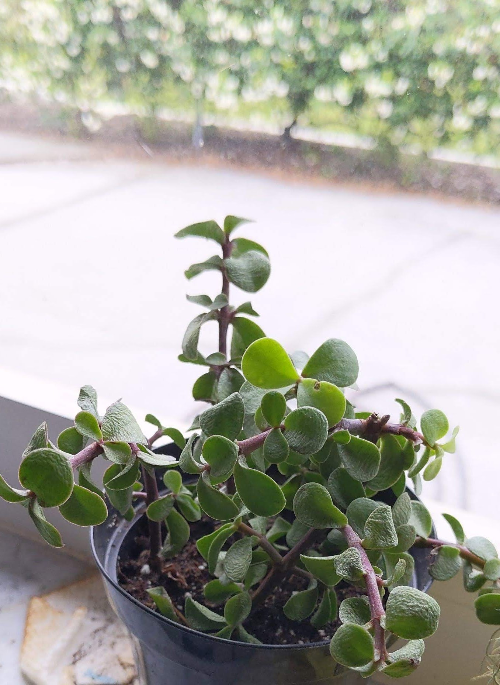
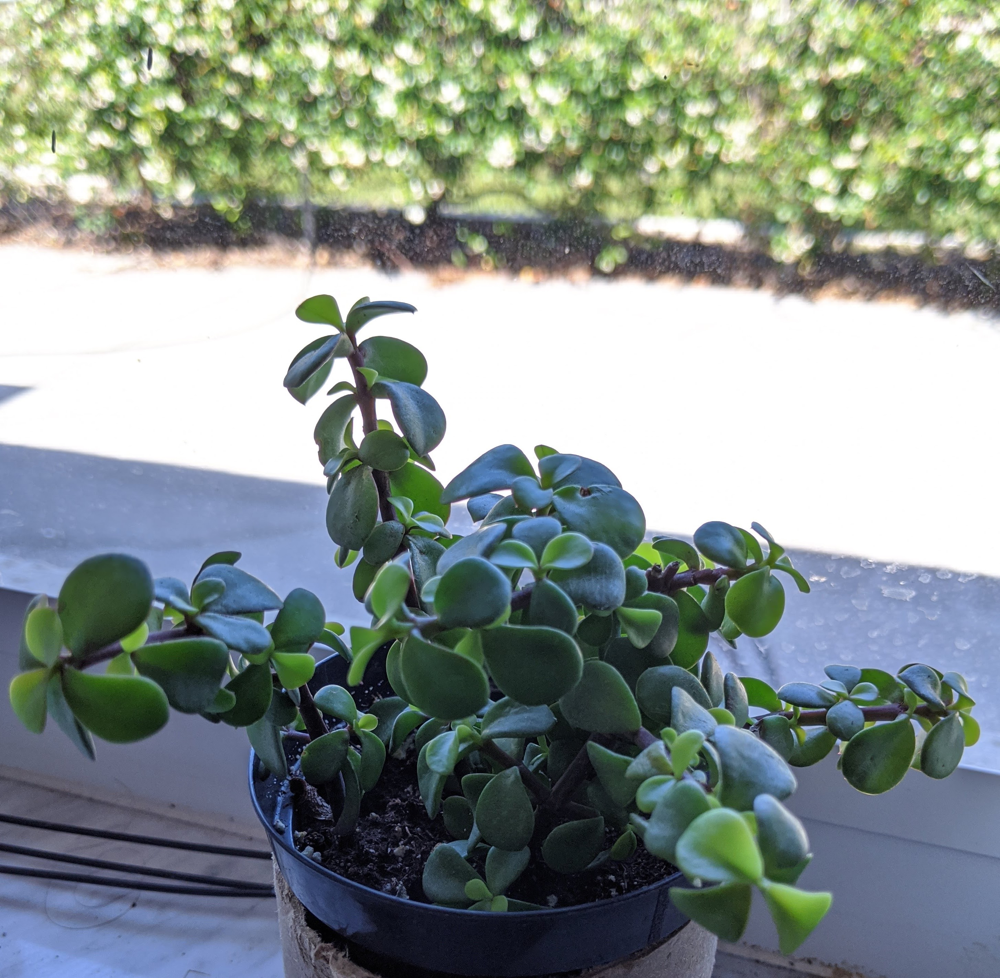

+++
title = "Elephant bush succulent"
date = 2020-05-17T10:36:00-04:00
description = "A little water and sunshine goes a long way!"
[taxonomies]
tags = ["gardening"]
+++

I bought a wilting succulent the other day from a home improvement store to see if it could be revived.

It's an [Elephant bush succulent](https://en.wikipedia.org/wiki/Portulacaria_afra), and [care instructions](https://www.gardeningknowhow.com/ornamental/cacti-succulents/portulacaria/growing-elephant-bush.htm) I found online recommended watering from spring to early fall. It perked up the day after I watered it:

It's been sitting in my west-facing window for a few days soaking up the sun and producing new growth.

Hopefully I can propagate it in a few weeks. :potted_plant:
