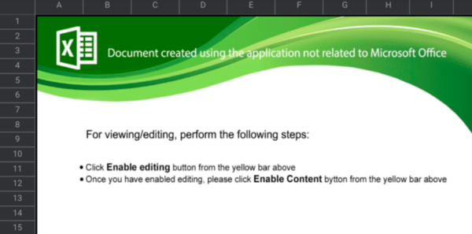

+++
title = "Re: You should read this"
date = 2021-03-18T21:58:20-04:00
description = "The tale of a malicious Excel macro"
draft = true
+++

## Background

Last spring I published [mipi-demo](https://github.com/hdl-util/mipi-demo), 
the culmination of my journey to stream video end-to-end from scratch on an FPGA.
It was one of my most challenging projects yet and I learned a lot from it.

Along the way I had the chance to contribute to the Linux kernel.
There's this [V4L2](https://en.wikipedia.org/wiki/Video4Linux) driver for the IMX219 camera module
that configures it over I2C.
While comparing it with some other configurations found on GitHub, I noticed that there
were two redundant register writes.
It wasn't a big deal but I thought it was worth making a patch and sending it out to the linux-media mailing list.
Suffice it to say I am now a proud Linux contributor. :penguin:

## An email arrives...

Roughly a year has passed since I submitted that patch.
I had forgotten all about it until a few days ago when I received the following email:

```
From:counter4_dwi24hours@dwidayatravel.com
Subject:Re: [PATCH] media: i2c: imx219: remove redundant writes
Date:Tuesday, March 16, 2021 12:32
Size:225 KB

Hello,

You should look at this


Regards,


CONFIDENTIALITY NOTICE: The information contained herein is intended for the use of the individual or entity to which it is addressed and may contain information that is privileged, confidential and exempt from disclosure under applicable law. If the reader of this transmission is not the intended recipient or the employee or agent responsible for delivering the contents to the intended recipient, you are hereby notified that any dissemination, distribution or copying of this communication is strictly prohibited. If you have received this communication in error, please notify the sender immediately.

2307013695_03162021.zip
157 KB
```

Clearly this isn't an important email, but the subject made me think it might be.
Someone is scraping the kernel mailing list archives and emailing patch contributors en masse.
No doubt there's more junk mail headed my way! :mailbox:

What's interesting about this spam email is that it's also malicious.
The attachment is a ZIP archive containing an Excel document:



:rotating_light: Virus alert[^3] :rotating_light:

Aside from misspelling button as *bytton* and the poor grammar,
an Excel document that asks you to enable editing is a sure sign of a macro attack.
Once enabled the macro will automatically run and do whatever the attacker intended.
It's just as bad as downloading a program from an unscrupulous website and trusting it,
but that may not be as obvious.

The last time I heard of an Excel macro attack was high school before everyone started using [Google Sheets](https://www.google.com/sheets/about/).
So what gives?

According to security researchers, these attacks are [on the rise again](https://www.csoonline.com/article/3597913/why-excel-4-0-macro-exploits-are-surging.html).
It's a smart attack vector; 76% of desktop computers run Windows[^1], and the majority have Excel installed in some form.
This particular variant uses XLM macros which are compatible with *any version of Excel*[^2].
VBA macros superseded them back in 1993 but they are supported for backwards compatibility.
Most macro attacks are done with VBA macros so research tends to target those instead.

These are the ideal conditions for an attacker: a niche but widespread technology that lets them stay one step ahead.
Microsoft is [building better protections](https://www.microsoft.com/security/blog/2021/03/03/xlm-amsi-new-runtime-defense-against-excel-4-0-macro-malware)
against malicious XLM macros, but not everybody is using Office 365.

[^3]: [Virus Alert by Weird Al Yankovic](https://www.youtube.com/watch?v=zvfD5rnkTws), YouTube

[^1]: [Desktop Operating System Market Share Worldwide](https://gs.statcounter.com/os-market-share/desktop/worldwide/#monthly-202012-202012-bar), *statcounter GlobalStats*, February 2021

[^2]: [Microsoft Excel > Macro programming > History](https://en.wikipedia.org/wiki/Microsoft_Excel#History), *Wikipedia*

## Analysis

Learning about this kind of attack was interesting, but there was still one burning question I wanted to answer:
*what does this worksheet actually do?* Finding answers would take time so I made it into a mini-project.
I have no background or experience in analyzing malicious code but might as well dive right in! :slightly_smiling_face:

### Detective work :detective:

Before trying to understand the code, I thought it might be interesting to look at the metadata to get info on the creator.
I had planned to write a few lines in Rust but there aren't any good libraries for this niche problem. [Calamine](https://crates.io/crates/calamine) was promising but it couldn't parse the file.
Instead I used Philippe Lagadec's [oletools](https://github.com/decalage2/oletools), a collection of tools written in Python for analyzing Microsoft office files. Here are the file's properties:

```
> olemeta 2307013695_03162021.xls
Properties from the SummaryInformation stream:
+---------------------+------------------------------+
|Property             |Value                         |
+---------------------+------------------------------+
|codepage             |1251                          |
|author               |Rabota                        |
|last_saved_by        |Operator                      |
|create_time          |2015-06-05 18:19:34           |
|last_saved_time      |2021-03-16 10:08:12           |
|creating_application |Microsoft Excel               |
|security             |0                             |
+---------------------+------------------------------+
```

Rabota (работа in Cyrillic) seems to mean job/work in Slavic languages.
It's a safe bet that this file was created by someone in Eastern Europe or Russia.
Operator is probably the guy sending out these emails.
The fact that it was originally created in 2015 is a bit odd though.
Why is it suddenly resurging after six years?
Rabota probably wrote the original attack and Operator purchased it recently. Or maybe it's only now making its way through the hacker forums, but this is all just speculation. :shrug:

#### Raw email (.eml)

Another thing to check was the raw .eml file downloaded from my email provider. The headers there might shed some more light on the sender:

```
...
X-Sieve: CMU Sieve 3.0
X-Spam-known-sender: no
X-Spam-sender-reputation: 500 (none)
X-Spam-score: 2.8
X-Spam-hits: DOS_OUTLOOK_TO_MX 1.449, FORGED_OUTLOOK_HTML 0.001,
  FORGED_OUTLOOK_TAGS 0.565, HTML_MESSAGE 0.001,
  HTML_MIME_NO_HTML_TAG 0.635, ME_SENDERREP_NEUTRAL 0.001,
  MIME_HTML_ONLY 0.1, MISSING_MID 0.14, RCVD_IN_DNSWL_NONE -0.0001,
  RCVD_IN_MSPIKE_H3 0.001, RCVD_IN_MSPIKE_WL 0.001, SPF_HELO_NONE 0.001,
  SPF_PASS -0.001, LANGUAGES en, BAYES_USED none, SA_VERSION 3.4.2
...
X-Mail-from: counter4_dwi24hours@dwidayatravel.com
...
Received-SPF: pass
    (dwidayatravel.com: Sender is authorized to use 'counter4_dwi24hours@dwidayatravel.com' in 'mfrom' identity (mechanism 'include:emailsrvr.com' matched))
    receiver=mx3.messagingengine.com;
    identity=mailfrom;
    envelope-from="counter4_dwi24hours@dwidayatravel.com";
    helo=smtp76.iad3b.emailsrvr.com;
    client-ip=146.20.161.76
...
MIME-Version: 1.0
X-Mailer: Microsoft Outlook 16.0
...
```

Sure enough, there is some interesting information. The email claims to have been sent with Outlook 2016.
However, when you look at the spam hits, [SpamAssassin's](https://spamassassin.apache.org/) `FORGED_OUTLOOK_TAGS` suggests that this message has elements you can't normally create with Outlook.
So the attacker could be masquerading as an Outlook sender to bypass spam filters. :monocle_face:

#### ZIP

I was going to move on when it occurred to me that I had overlooked something: the metadata of the ZIP file itself! :exploding_head:
Programs might leave a signature when compressing files. Maybe it's a comment or something as subtle as the compression level.
*zipinfo* sounded like just the right tool for the job:

> zipinfo lists technical information about files in a ZIP archive, most commonly found on MS-DOS systems. Such information includes file access permissions, encryption status, type of compression, version and operating system or file system of compressing program, and the like.

```
> zipinfo -v 2307013695_03162021.zip
...
Central directory entry #1:
---------------------------

  2307013695_03162021.xls

  offset of local header from start of archive:   0
                                                  (0000000000000000h) bytes
  file system or operating system of origin:      MS-DOS, OS/2 or NT FAT
  version of encoding software:                   6.3
  minimum file system compatibility required:     MS-DOS, OS/2 or NT FAT
  minimum software version required to extract:   2.0
  compression method:                             deflated
  compression sub-type (deflation):               normal
  file security status:                           not encrypted
  extended local header:                          no
  file last modified on (DOS date/time):          2021 Mar 16 16:26:02
  32-bit CRC value (hex):                         a4655657
  compressed size:                                156452 bytes
  uncompressed size:                              237056 bytes
  length of filename:                             23 characters
  length of extra field:                          36 bytes
  length of file comment:                         0 characters
  disk number on which file begins:               disk 1
  apparent file type:                             binary
  non-MSDOS external file attributes:             000020 hex
  MS-DOS file attributes (20 hex):                arc 

  The central-directory extra field contains:
  - A subfield with ID 0x000a (PKWARE Win32) and 32 data bytes.  The first
    20 are:   00 00 00 00 01 00 18 00 49 f5 b8 c2 4e 1a d7 01 49 f5 b8 c2.

  There is no file comment.
```

It's hard to know what information is relevant but one thing's for sure:
the zip file was created on Windows about six minutes before the email was sent.

### The macro itself

With all the preliminary investigation out of the way, it was finally time to
dissect the macro. I relied on oletools to point me in the right direction:

```
> olevba 2307013695_03162021.xls
...
+----------+--------------------+---------------------------------------------+
|Type      |Keyword             |Description                                  |
+----------+--------------------+---------------------------------------------+
|AutoExec  |Auto_Open           |Runs when the Excel Workbook is opened       |
|Suspicious|FORMULA.FILL        |May modify Excel 4 Macro formulas at runtime |
|          |                    |(XLM/XLF)                                    |
|Suspicious|EXEC                |May run an executable file or a system       |
|          |                    |command using Excel 4 Macros (XLM/XLF)       |
|Suspicious|REGISTER            |May call a DLL using Excel 4 Macros (XLM/XLF)|
|Suspicious|Base64 Strings      |Base64-encoded strings were detected, may be |
|          |                    |used to obfuscate strings (option --decode to|
|          |                    |see all)                                     |
+----------+--------------------+---------------------------------------------+
```

There's definitely something strange going on here.
The macro is running system code via DLLs and/or EXEs.
It also appears to be self-modifying to trick naive analysis techniques.
