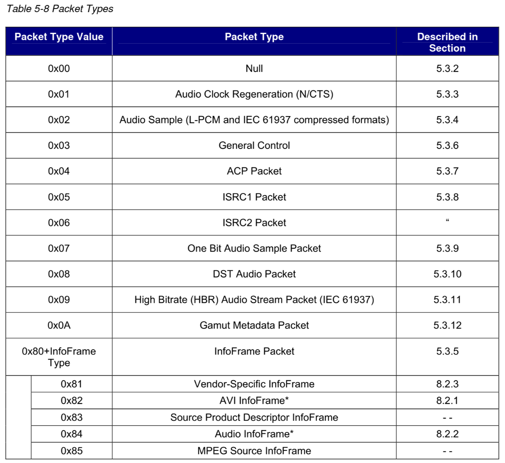
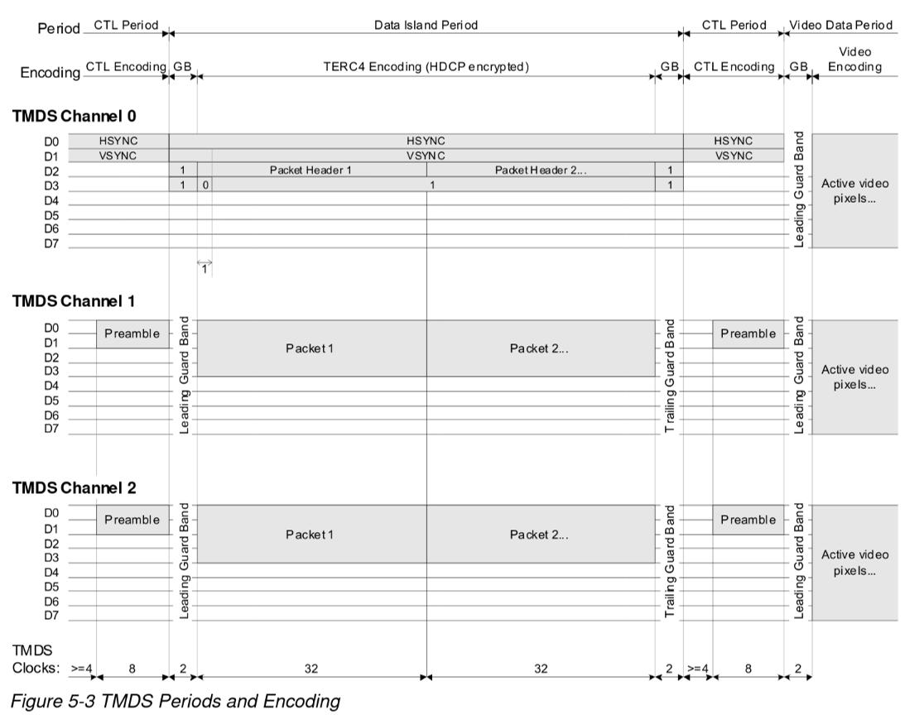
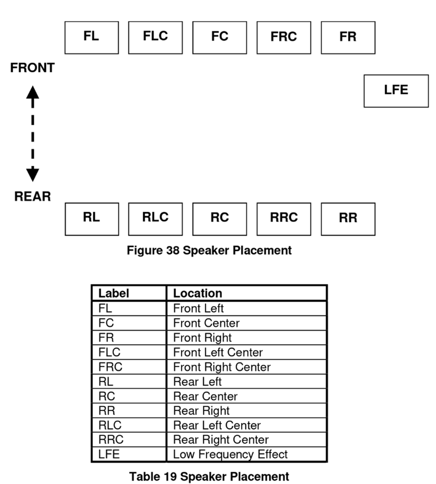
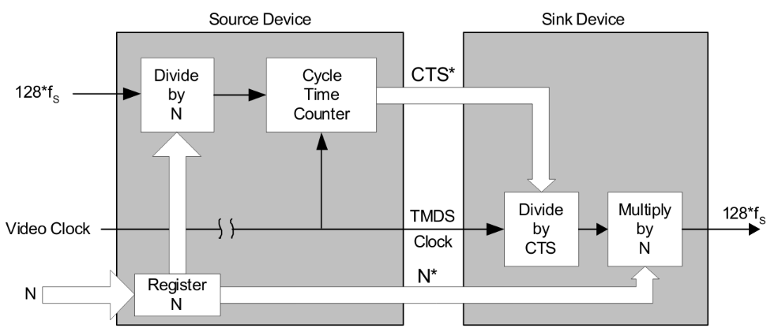
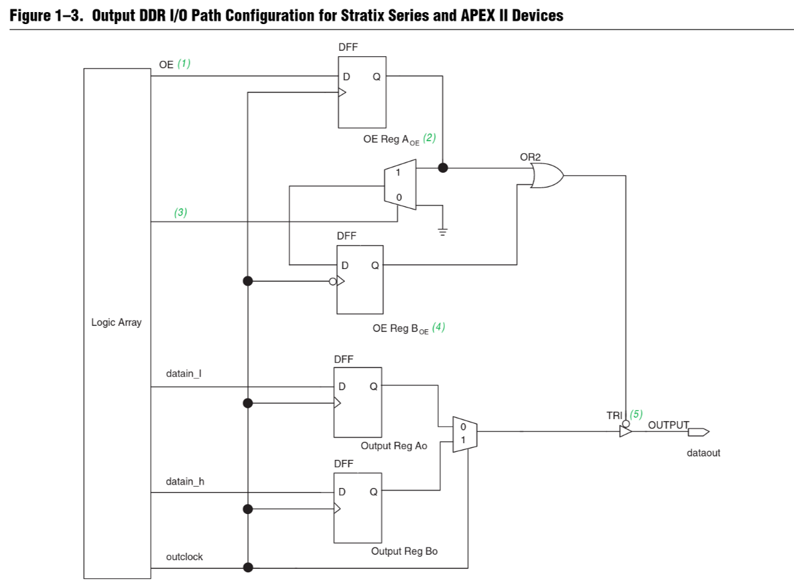

+++
title = "Minimal HDMI for FPGAs Released"
date = 2020-04-24
description = "Celebrating the first stable release of the project with a recap, discussion of changes, and what's next."
+++

Last summer, I started working on a [general purpose HDMI implementation for FPGAs](@/blog/hdmi_on_fpga/index.md). Things have come a long way since then. After being [featured on HackerNews](https://news.ycombinator.com/item?id=22279308), the [GitHub repository](https://github.com/hdl-util/hdmi/) now has over 200 stars. There are several features I've implemented since my last post which I'll discuss below.

## Terminology

* [Field-Programmable Gate Array (FPGA)](https://en.wikipedia.org/wiki/Field-programmable_gate_array): an integrated circuit that can be configured for different use cases, as opposed to a central processing unit (CPU) or a graphical processing unit (GPU), which are application-specific integrated circuits
* [High-Definition Media Interface (HDMI)](https://en.wikipedia.org/wiki/HDMI):  a popular video/audio interface available in almost every TV
* [Digital Visual Interface (DVI)](https://en.wikipedia.org/wiki/Digital_Visual_Interface):  the predecessor of HDMI that only supports video over a bulky connector
* [Transition Minimized Differential Signaling (TMDS)](https://en.wikipedia.org/wiki/Transition-minimized_differential_signaling): a coding algorithm used in HDMI and DVI that reduces electromagnetic interference (EMI), letting you use really long cables

## True HDMI Output

### DVI ⊂ HDMI

A lot of the HDMI VHDL/Verilog code I saw in the beginning was actually just DVI, but sent over an HDMI connector. HDMI displays are supposed to be backwards compatible with DVI signals, which is why there are some passive DVI to HDMI adapters out there:

 *User:BengtLueers [CC-BY-SA](https://creativecommons.org/licenses/by-sa/3.0), via Wikimedia Commons*

DVI uses the same 8b/10b TMDS encoding scheme as HDMI, but there are no data islands and no guard bands. This means that DVI can send ONLY video, whereas HDMI can transmit much more information.

### HDMI is not free

This is the biggest difference between DVI and HDMI. DVI is free to use, but HDMI has royalties enforced by the HDMI Alliance. You're free to use HDMI for testing/development, but you have to become an HDMI adopter to use it in end-consumer products. As an adopter, you pay a ~$1k - $2k annual flat fee with a $0.05 per device royalty. You can [read more about it in the repo README.md](https://github.com/hdl-util/hdmi/#hdmi-adoption).

### Data Islands

HDMI takes advantage of the extra space in the video frame to send auxiliary data in data islands. Each data island contains anywhere from 1 to 18 data packets. Data packet types include: audio sample, audio clock regeneration, general control (i.e. TV muting), gamut metadata, deer color control, product/vendor information, and much more.

### Guard bands

Guard bands are used to reliably detect transition to data periods. Video data has a leading guard band. Data islands have both leading and trailing guard bands since they are variable in length.

### Backwards compatibility

Though the HDMI module is technically for outputting HDMI v1.4a, it can also output DVI only, configurable by the `DVI_OUTPUT` parameter. This is useful for reducing FPGA resource usage when only sending video, connecting to a DVI display, or for end-user products that aren't licensed with the HDMI alliance.

## Audio

To send audio, three data packets needed to be implemented: audio info frame, audio sample packet, and audio clock regeneration packet.

### Audio Info Frame
 
The audio info frame data packet describes the audio channel configuration including speaker placement and the number of channels. The HDMI implementation is configured for 2-channel audio with front left and front right speakers. Other information is included with the sample itself.

### Audio Sample

There are many different supported formats for HDMI audio transmission. The simplest to implement and use is Linear Pulse Code Modulation (L-PCM). The displacement of a speaker's membrane from the origin is represented by linear steps. The step resolution depends on the audio bit width, which can be configured to be anywhere from 16-bit to 24-bit. The audio frequency can also be set to 32 kHz, 44.1 kHz, or 48 kHz. 44.1 kHz and 48 kHz should be sufficient for covering the human hearing range.

### Audio Clock Regeneration

With an audio jack, you can just drive the speakers directly without worrying about synchronization. Sending audio over HDMI is a completely different story. Being constrained to sending audio samples in data islands mean that you can't send audio in real-time, and you have to worry about the audio clock. There's some complex circuitry in place which essentially configures a clock generator in the HDMI sink with a multiplier and divider. The HDMI implementation calculates these values on the fly to avoid skips and jitters in the audio if the audio clock does not conform to the expected values for a sampling rate (i.e. slightly faster, out of phase, etc.).

*If you are looking at implementing HDMI yourself and run into issues with configuring the divider (N) and multiplier (CTS), changing it too frequently will prevent the clock generator from locking and you will never hear any audio. I struggled with this issue for weeks, so I hope this helps!*

## Double-data Rate I/O (DDRIO)

To output the TMDS 8b/10b encoding, a clock ten times as fast as the pixel clock is typically used. High resolutions require really high clocks at or above 1 GHz. Most FPGAs cannot support these speeds. Double data rate I/O lets you perform I/O on the positive and negative edges of a clock. Thus, the required clock frequency is only 5 times as fast. Outputting 720p video is much more achievable now.

## What's next?

There are a bunch of HDMI features that can still be implemented. For most use cases, the current implementation is good enough. Sending surround sound or deep color formats is better suited to stereo receivers and graphics cards respectively. I'm working on implementing glue logic for other peripherals like MIPI cameras, which I'll be posting about soon.
