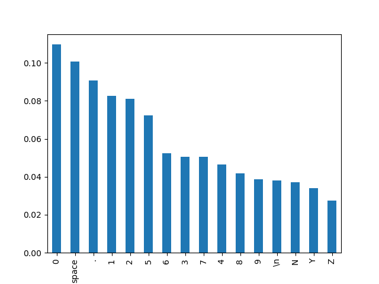

+++
title = "MeatPack Algorithm"
date = 2024-05-28T21:04:36-07:00
description = "Walkthrough of motivating ideas and the implementation"
[taxonomies]
tags = ["g-code", "compression"]
+++

This post is the second in a series on [binary G-code](@/blog/binary_g_code/index.md).
Today I will talk about [MeatPack](https://github.com/scottmudge/OctoPrint-MeatPack), a G-code compression algorithm.

## Content-aware Compression

When compressing arbitrary data, you need a lossless compression algorithm like [Deflate](https://en.wikipedia.org/wiki/Deflate) or [LZMA](https://en.wikipedia.org/wiki/Lempel%E2%80%93Ziv%E2%80%93Markov_chain_algorithm). Both are general purpose and achieve good compression ratios on pretty much everything. Without any prior knowledge about the data, they need significant CPU and memory resources to figure out how to shrink it down. This is usually not an issue for modern commodity hardware.

However, it does matter in the G-code scenario where we are [streaming data to a microcontroller for real time processing](@/blog/binary_g_code/index.md#motivation). Our resources are so limited that using even a few kilobytes of memory is hard to justify. Baking our own _content-aware_ compression is a way to work around this; we know that we are sending G-code and only G-code. Take a look at the frequency distribution of the 16 most common characters in some [example G-code files](https://github.com/sameer/g-code/tree/v0.4.0/tests):

*Generated with Python using Matplotlib, [hist.py](hist.py)*

They account for ~95.42% of the characters in a G-code file, so it's possible to come up with some encoding that takes advantage of this.

## MeatPack

[MeatPack](https://github.com/scottmudge/OctoPrint-MeatPack) compresses G-code by leveraging these statistics. Common G-code characters are replaced with a shorter 4-bit representation using a static lookup table:

|character|4-bit code|
|---|---|
|0-9|0-9|
|.|10|
|E|11|
|\n|12|
|G|13|
|X|14|
|other|N/A|

Before going into specifics, let me drop some bullets on why this approach is a great fit for our microcontroller scenario:

- Extremely low memory usage: no heap allocation, uses under ~40 bytes of which only 2 are on the stack
- Simple logic: no loops, just conditional logic
- Simple math: no expensive multiplications, just bitwise shifts/ORs

### Compression

Characters are encoded in pairs of 2. The encoded representation can be 1 to 3 bytes depending on whether or not they are in the lookup table:

- Both characters have a 4-bit code: packed into a single byte as `first_code | (second_code << 4)`
- One character doesn't have a 4-bit code: `15` is used as a signal code to indicate that a character could not be packed and is represented by the next byte
- Neither has a 4-bit code: both characters have a signal code `15`, indicating that they are represented by the two bytes that follow

If the input has an odd number of characters, it is padded to an even number with a space so we always have pairs. If the input has lowercase E, G, or X, it is converted to uppercase so it will have a 4-bit code. G-code is case insensitive so this is harmless[^1].

[^1]: ignoring G-code strings

### Decompression

Decompression is quite straightforward. The lookup table is inverted and we check for signal codes as we go:

- Byte has no signal codes: unpack two characters
- Byte has an upper signal code: unpack the first character, the second will come next
- Byte has a lower signal code: unpack the second character, the first will come next
- Byte has both signal codes: discard character, the next two bytes are characters

### Control

MeatPack has some command sequences to control the decompression process. A sequence of `[255, 255]` indicates that the next byte will be a command byte. The defined command bytes are:

|Byte|Command|Explanation|
|---|---|---|
|251|Enable packing|Turns on MeatPack|
|250|Disable packing|Turns off MeatPack|
|249|Reset all|Resets internal state. Usually sent at the end of MeatPack data|
|248|Query config (?)|Unknown, can be ignored|
|247|Enable no space mode|Replaces `E` with ` ` in the lookup table|
|246|Disable no space mode|Replaces ` ` with `E` in the lookup table|

MeatPack is disabled by default so there will always be an "enable packing" command sequence before compressed data begins.

### Comments and Strings

This compression scheme is great when data fits the expected histogram. However, it doesn't perform well on comments or [quoted strings](https://www.reprap.org/wiki/G-code#Quoted_strings) and can actually increase size by 50%. The histogram is completely different for these types so packing becomes unlikely. With that in mind, the encoder should disable MeatPack whenever a comment or string begins and send it literally.

## What's next

My goal in understanding MeatPack was to port it to Rust so that [svg2gcode](https://github.com/sameer/svg2gcode) can eventually read/write [binary G-code](@/blog/binary_g_code/index.md). The port is available in the [g-code](https://docs.rs/g-code/latest/g_code/) crate. There are a few more pieces needed before binary G-code can be fully supported. The next post in this series will talk about another compression algorithm called [HeatShrink](https://github.com/atomicobject/heatshrink/).
