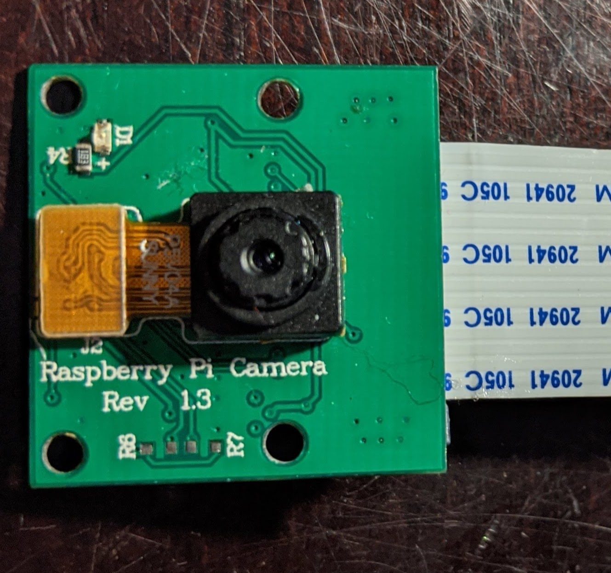
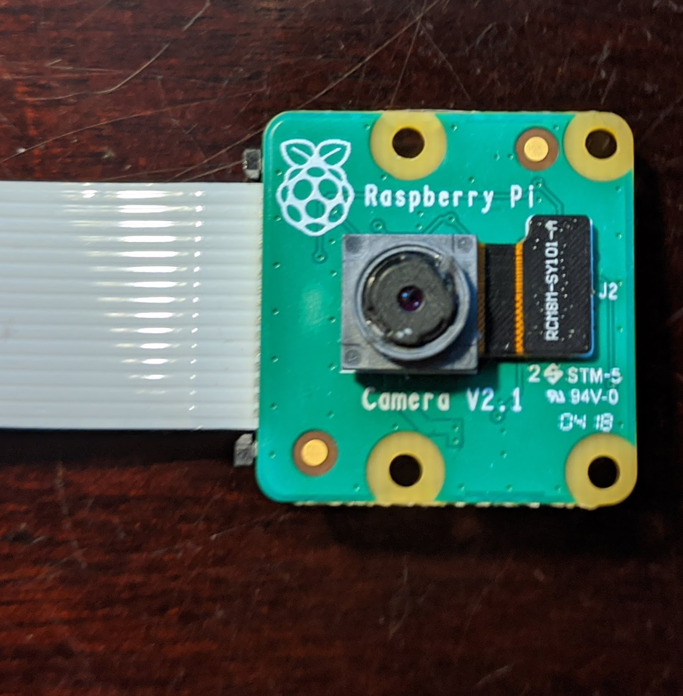
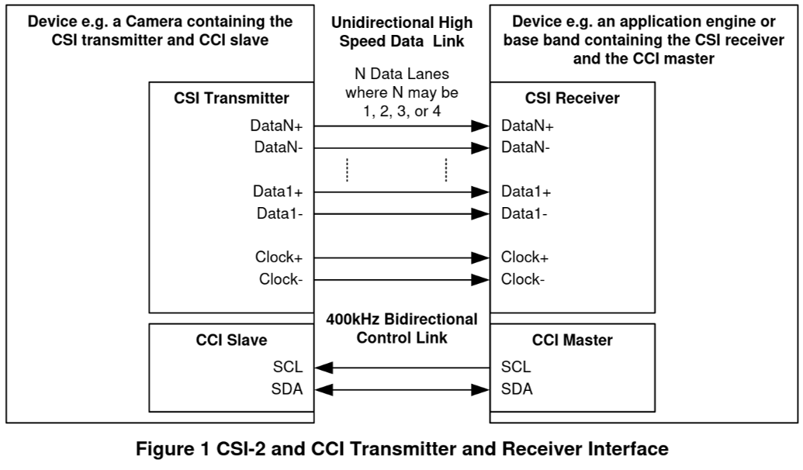
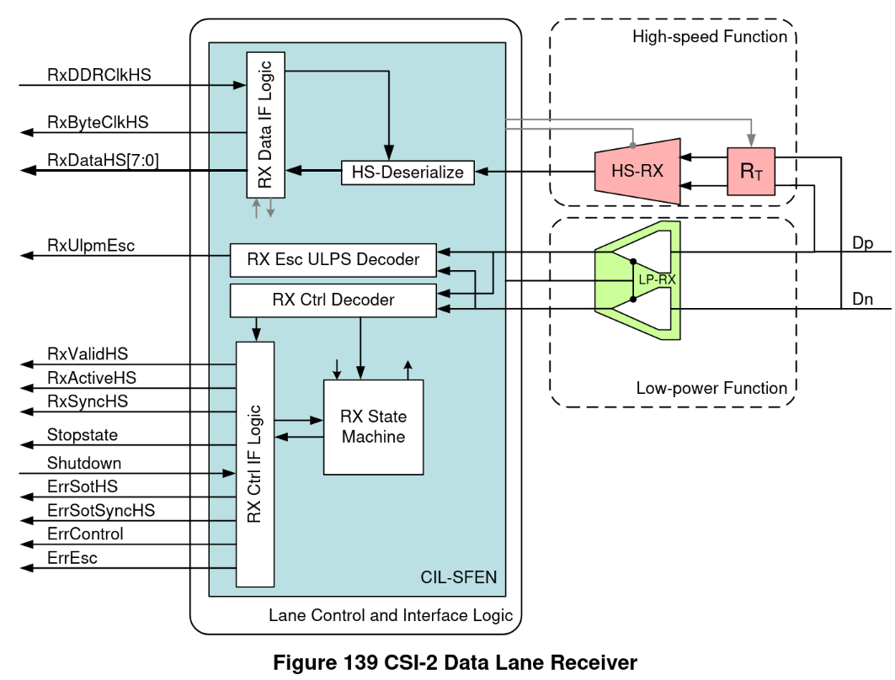
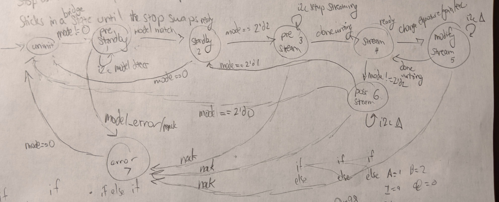
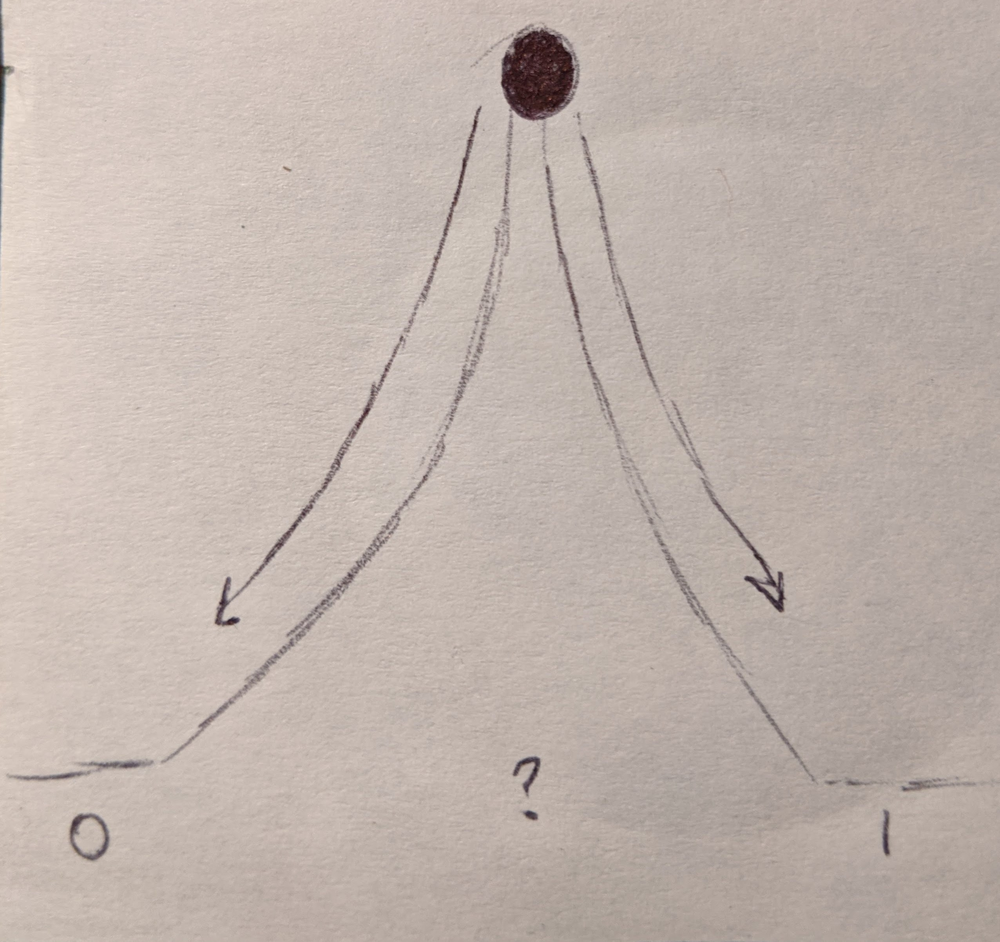
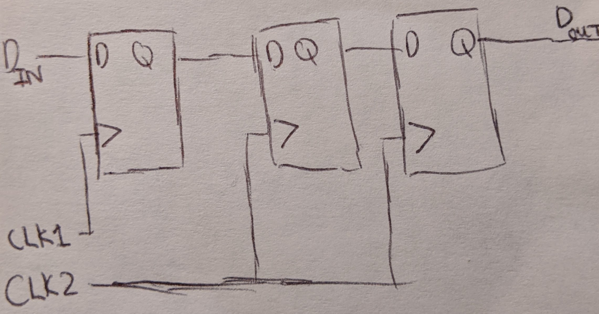
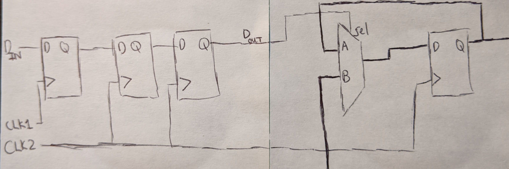
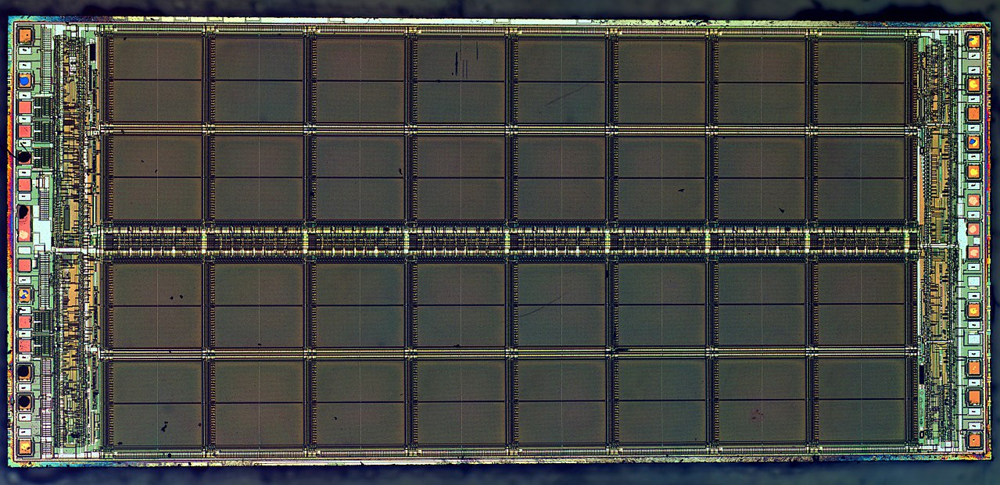
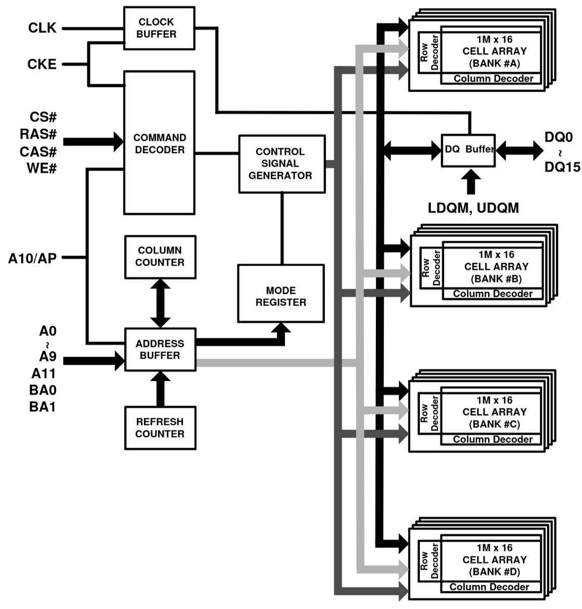

+++
title = "Interfacing FPGAs with MIPI Cameras"
date = 2020-05-16T02:50:39-07:00
+++

The FPGA board I'm using has a bunch of peripherals, and I've been writing SystemVerilog code to support them one by one. I posted about my [HDMI work](/blog/hdmi-on-fpga/) before, which has since reached maturity. The next step was naturally video input. It's been a long journey, and there's still more to be done.

## Inter-IC Bus (I2C)

Before even working with any camera-specific logic, I needed an [I2C bus master](https://github.com/hdl-util/i2c). It is used to control the camera configuration (i.e. begin streaming, change gain/exposure, change FPS, etc.). The hardest part was getting the timing right. It is simple in principal, but because you could interface many different I/O technologies with an arbitrary arrangement of wire, capacitance and resistance play a big part. Once I got I2C working, it was time to work on interfacing with the camera.
 
## MIPI Cameras

If you've ever worked with a Raspberry Pi, you've probably heard of the [Raspberry Pi Camera Module](https://www.raspberrypi.org/products/camera-module-v2/https://www.raspberrypi.org/products/camera-module-v2/). There are two versions of the module made by the Raspberry Pi Foundation has two versions. Version 1.x has an OmniVision OV5647 sensor and version 2.x has a Sony IMX219 sensor.

There is also a new ["High Quality" camera](https://www.raspberrypi.org/products/raspberry-pi-high-quality-camera/) with a Sony IMX477 but it costs $50. Getting a lens for it costs even more: ~$62.

The three modules use interfaces created by the MIPI Alliance: Camera Serial Interface v2 and Camera Control Set v1.1.

### MIPI Camera Serial Interface (CSI) v2 

CSI uses low voltage differential signaling (LVDS) to transmit packets of data from the camera module to the receiver. There are a total of up to 5 LVDS pairs. The first is the clock. The clock frequency is configured via MIPI CCS. The four remaining pairs, referred to as lanes, transmit the data itself. More lanes means a higher possible framerate and larger resolutions. There are two types of packets: short and long. Long packets can contain image data as a line of pixels in the image. Short packets usually contain control information (i.e. start/end of line, start/end of frame, etc.).

Technically, CSI is implemented on top of MIPI D-PHY, which defines the low-level physical and electrical characteristics of the interface. There should be a secondary low-power function on each lane including the clock that detects when a packet will begin and end:

However, because the board I'm using only has the high-speed function, the SystemVerilog implementation must constantly listen for the 8-bit synchronization sequence present at the beginning of a packet.

### MIPI Camera Control Set (CCS) v1.1

Before capturing video, you have to configure the camera over I2C. There are a few common registers defined in CCS, but most of the important ones like clock tree configuration and CMOS sensor tuning are manufacturer specific. The [Linux kernel](https://github.com/torvalds/linux/blob/master/drivers/media/i2c/) has drivers for most camera modules.

After reading the datasheet for IMX219, I implemented a driver with a few resolution modes. Here's the rough state machine diagram:

1. In pre-standby, the driver checks whether the model matches and puts the camera into standby. If not, it enters an error state.
2. Once in standby, the driver enters pre-stream where a series of i2c register writes and reads are run to set the camera configuration. Then the camera is instructed to begin streaming.
3. During streaming, the driver can be instructed to stop streaming or modify streaming (i.e. change exposure/gain)
4. In post-stream, the driver prepares the camera module to be gracefully shut down or put into standby

I've also implemented a driver for OV5647 that does just 640x480 for now, using the same interface and state machine concept. My hope is that eventually there will be a collection of drivers that enables plug and play usage of arbitrary MIPI camera modules. It would just be a matter of detecting the model and applying the right configuration over I2C.

## Connecting everything together

Now that all the components were there, I thought it would be pretty straightforward to display the camera feed over HDMI. That was definitely wrong, and it's been about a month since then.

### Clock domain crossing

To get the data from the MIPI CSI clock domain to the HDMI clock domain, you can't just clock a set of flip-flops with one clock and read them with the other. There's metastability to worry about! Consider the analogy of a ball at the top of a hill:

The ball could fall to either side of the hill. That's metastability in a nutshell; it means the value you read could be either 0 or 1. It usually occurs in clock domain crossing when the two clocks don't have a synchronous relationship and setup/hold violations occur. I've seen several techniques for resolving metastability:

#### Synchronizer Chain

If you're sending a single bit control signal, a good idea is to use a chain of flip-flops clocked by the receiving domain. One or two synchronizers is often enough. The chain deals with metastability by giving the control signal extra time to settle before the receiving domain actually uses the value.

#### Synchronizer + Mux

To send a multi-bit value along with the control signal, you can add a mux to the sync chain concept:

The mux will swap its data bus from the flip-flop feedback path to the bus from the other clock domain once the control signal is received. At that point, the data will have settled and is no longer metastable.

#### Dual-Clock Fifo

Sending large amounts of data at a high speed requires a dual clock fifo backed by dual clock RAM with gray code address pointers. Intel has one, but it's not too much work to write one. Debugging metastability can be hard though, since failures will appear infrequently and be difficult to reproduce.

### DRAM Buffering

After dealing with clock domain crossing for a few weeks, I had little luck. The pixels on the screen were a jittering mess. Shining a light over the camera told me none of the image data was actually reaching my display. This is when it hit me -- a FIFO on the FPGA could never be large enough to directly transmit video over HDMI.

Say you wanted to capture 640x480 video and display it over HDMI. The HDMI frame will be slightly larger at 800x525 to accommodate the VSYNC/HSYNC signals and send auxiliary data like audio. For 112,800 of the pixels, video is not being sent. 
That amounts to around 330 KB of data (112,800 * 24 bits / 8 bits/byte / 1024 bytes/kilobyte), which could easily overflow the FIFO. Instead I needed to use an SDRAM chip to store the captured video and read it back for HDMI transmission. 

I implemented an [SDRAM controller](https://github.com/hdl-util/sdram-controller) and posted about it on the [Arduino MKR Vidor 4000 forum](https://forum.arduino.cc/index.php?board=125.0) and it has since garnered some attention.

The TL;DR of DRAM is it's a grid of really small capacitors that either store no charge (0) or full charge (1). The capacitors discharge over time and have to be refreshed periodically. The wires themselves have capacitance, so they must be precharged to avoid stealing charge from the capacitors during a read/write.

*User:ZeptoBars [CC-BY-SA](https://creativecommons.org/licenses/by-sa/3.0), via Wikimedia Commons*

The address of a value in DRAM consists of three parts: a bank address, a row address, and a column address. The bank and row addresses are set with a bank activate command. That is followed by a read/write command which sets the column address. It's fast to read a capacitor in the same bank and row because only the column has to be changed.

## Is it done?

I've successfully stored data in the DRAM and read it back for displaying over HDMI. However, I haven't been able to store the captured video in the SDRAM yet. I tried but the unintelligible pixel jittering is still present. It's likely that I missed a minor detail that, once fixed, will make it magically work.

It may yet be a month more before things are working. Stay tuned!
