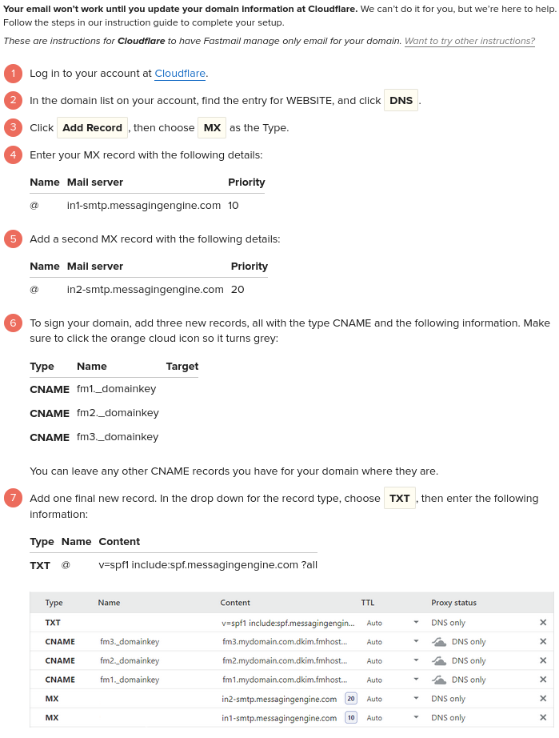
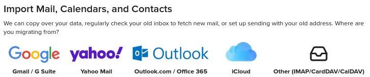
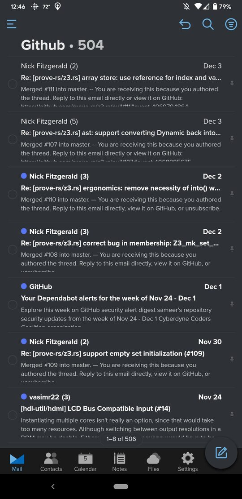

+++
title = "Switching from ProtonMail to Fastmail"
date = 2020-12-05T10:30:00-05:00
description = "Documenting my motivations for switching email providers, the steps involved, and first reactions."
[taxonomies]
tags = ["email"]
+++

In 2018, I decided to start using my own domain name for email.
Running my own mail server would have cost more than using an email service, and there's always a chance that other servers mark your emails as spam. So I signed up for a two-year ProtonMail Plus plan and set up my custom domain.

ProtonMail has served me well. But those two years are up now, and after re-evaluating my options, I'm switching to Fastmail. It's a clear winner if you compare plans at the same price point:

|         | PM Plus | FM Standard |
|---------|---------|-------------|
|Price|$96 / 2 years|$90 / 2 years|
|Custom Domains|1|Unlimited|
|Custom Domain Aliases|1|600+|
|Catch-All Email|No|Yes|
|Storage|5GB|30GB|
|Messages/day|1000|Unlimited|
|Folders|200|Unlimited|

Below is how I migrated:

## Custom Domain

This part was pretty painless. Fastmail gives provider-specific instructions for how to add their records. Interestingly, [DKIM](https://en.wikipedia.org/wiki/DomainKeys_Identified_Mail) did not require a key pair [like it does for ProtonMail](https://protonmail.com/blog/dkim-key-management/).

## Transferring Mail

### Exporting from ProtonMail

Recently, ProtonMail released the [Import-Export app](https://protonmail.com/blog/import-export-app-release/). I used it to export my mail folders in `.mbox` format.

### Importing to Fastmail

Fastmail supports importing mail from popular hosted providers and IMAP servers directly from the browser.

ProtonMail doesn't fall under any of those categories. It has the ["bridge" app](https://protonmail.com/bridge/) for local IMAP, but Fastmail can't connect to that from their servers.

It turns out that there's an indirect way to get mail in `.mbox` format onto Fastmail using Thunderbird. I last used Thunderbird over 5 years ago. The UI has definitely come a long way; it's like Firefox but just for mail!

*Mozilla Foundation, CC BY-SA 3.0*

After installing Thunderbird, I configured IMAP [following Fastmail's instructions](https://www.fastmail.com/help/clients/thunderbird.html). Thunderbird doesn't have built-in functionality to import from `.mbox` files so I installed the [ImportExportTools NG](https://addons.thunderbird.net/en-US/thunderbird/addon/importexporttools-ng/?src=search) extension.

I created a local folder called "ProtonMail", and right clicking on that folder, selected `ImportExportTools NG > Import mbox file > Import directly one or more mbox files > <pick mbox files> > Open`. Now I had all my old mail from ProtonMail in Thunderbird. All that was left was to select all the messages, drag, and drop them into the equivalent Fastmail folders. Simple as that!

### Android App

In terms of functionality, the Fastmail app is far superior than other mail apps I've used. It appears to have feature parity with the website. What would be 5 separate Google apps is packed into a single app. Yet it doesn't feel overcrowded.

My only gripe is that the third line of message text is cut off in the inbox view:

Overall, it was a pretty easy switch. It only took an hour and I'm set for the next two years.