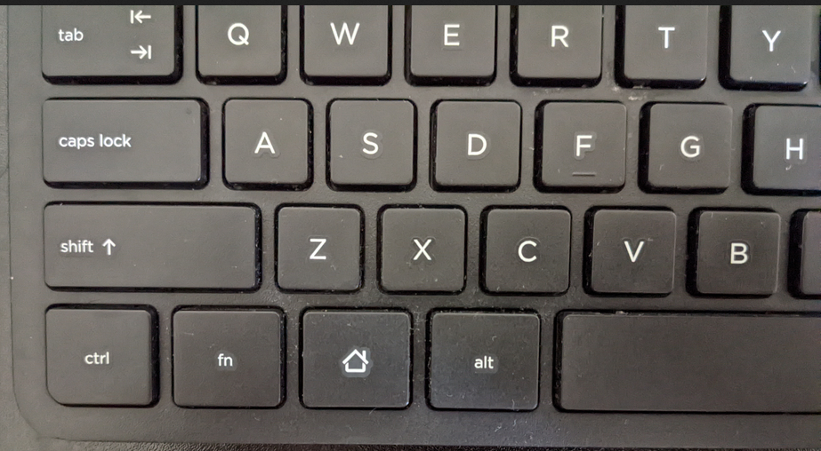

+++
title = "Remapping Keys for Sway"
date = 2022-05-08T16:28:33-07:00
description = "A simple way to remap a key on Sway WM."
[taxonomies]
tags = ["sway", "linux", "wayland"]
+++

I recently started using a Hewlett Packard SK-2026 keyboard with my laptop. It has a fairly standard layout except for one thing -- there is a  Home key where the  Windows key usually is.


Based on a [Japanese article about the HP Slate 21](https://ascii-jp.translate.goog/elem/000/000/881/881159/index-3.html?_x_tr_sl=auto&_x_tr_tl=en&_x_tr_hl=en&_x_tr_pto=wapp), it seems to be a variant for use with mobile devices. The Home key would open the Android launcher.

## Problem

I use the [Sway](https://en.wikipedia.org/wiki/Sway_(window_manager)) tiling window manager on Linux and having a Windows key is essential to my workflow. It maps to `Super_L` whereas the Home key maps to `XF86HomePage` and redirects the browser to the homepage. It is not a modifier key and thus cannot be used in lieu of `Super_L`.

There must be a way to remap the Home key so it appears as `Super_L` instead.

## Solution

### Xorg

[Xmodmap](https://wiki.archlinux.org/title/Xmodmap) is a utility for modifying key and mouse mappings in the [Xorg](https://wiki.archlinux.org/title/Xorg) (aka X) display server. However, I am using [Wayland](https://wiki.archlinux.org/title/Wayland) so this wouldn't work for me.

### Wayland

There isn't a great unified solution for remapping keys on Wayland. It still has a lot of room for improvement before it can be on par with Xorg.  The easiest approach I found was to replace the keycode's mapping in [XKB](https://en.wikipedia.org/wiki/X_keyboard_extension).

1. Install [aur/wev](https://aur.archlinux.org/packages/wev).
1. Get the keycode for the Home key using wev.
    ```
    [14:     wl_keyboard] key: serial: 27025; time: 16170860; key: 180; state: 1 (pressed)
                        sym: XF86HomePage (65515), utf8: ''
    [14:     wl_keyboard] key: serial: 27027; time: 16170940; key: 180; state: 0 (released)
                        sym: XF86HomePage (65515), utf8: ''
    ```
    It is 180 for this keyboard.
1. Find the key's mapping in `/usr/share/X11/xkb`.
    ```bash
    $ grep -r -e 'key.*180.*>' /usr/share/X11/xkb/
    symbols/inet:    key <I180>   {      [ XF86HomePage          ]       };
    ```
1. Change it to `Super_L`.
    ```bash
    $ sed -i 's|key <I180>   {      [ XF86HomePage|key <I180>   {      [ Super_L     ' /usr/share/X11/xkb/symbols/inet
    ```
1. Reload Sway, and the key is mapped correctly according to `wev`.
   ```
    [14:     wl_keyboard] key: serial: 33081; time: 17356569; key: 180; state: 1 (pressed)
                        sym: Super_L      (65515), utf8: ''
    [14:     wl_keyboard] modifiers: serial: 0; group: 0
                        depressed: 00000040: Mod4
                        latched: 00000000
                        locked: 00000000
    [14:     wl_keyboard] key: serial: 33083; time: 17356625; key: 180; state: 0 (released)
                        sym: Super_L      (65515), utf8: ''
    [14:     wl_keyboard] modifiers: serial: 0; group: 0
                        depressed: 00000000
                        latched: 00000000
                        locked: 00000000
   ```

Note that this changes the mapping for keycode 180 on *any* keyboard. It is possible that it could affect a keyboard with a Home key in a more traditional position i.e. in a multimedia section or as an alternate Function key action.

### The X in XKB

There is something odd though: XKB stands for the X keyboard extension, but Sway is on Wayland. Sway uses [wlroots](https://gitlab.freedesktop.org/wlroots/wlroots) for Wayland building blocks. This further uses [libxkbcommon](https://xkbcommon.org/) to parse and handle keyboard layouts. This library implements the XKB specification and does not have any relation with the X server itself. The symbols in `/usr/share/X11/xkb` are distributed in the [xkeyboard-config](https://www.freedesktop.org/wiki/Software/XKeyboardConfig/) package.