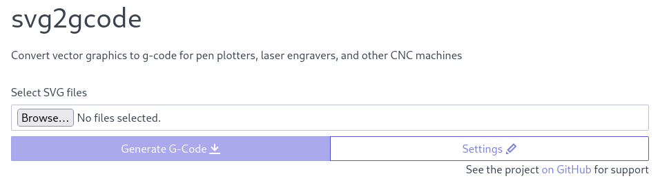
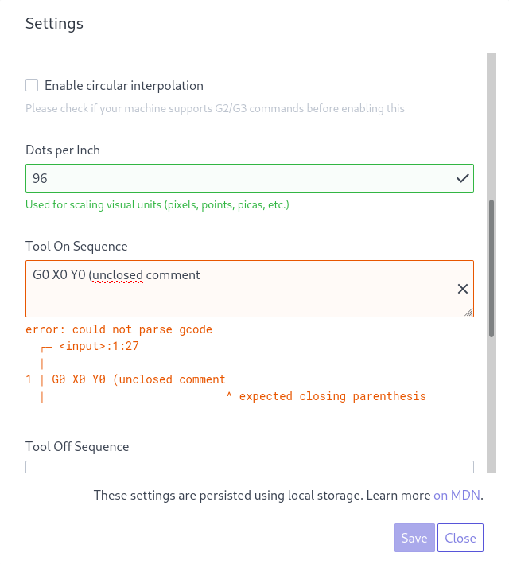
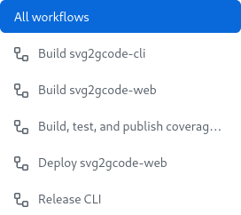
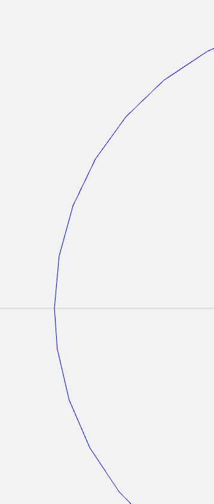
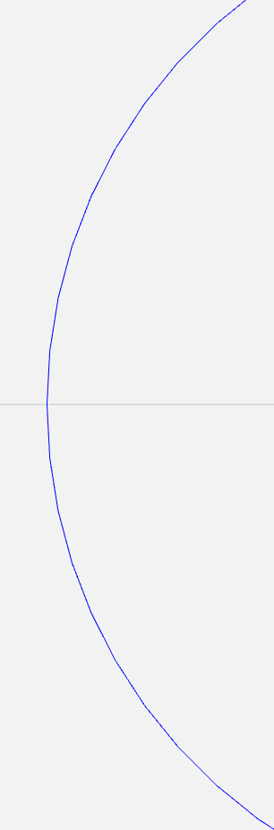

+++
title = "svg2gcode: Progress Update"
date = 2021-09-09T16:00:47-07:00
description = "A review of major changes and plans for the future"
[taxonomies]
tags = ["g-code", "svg"]
+++

[svg2gcode](https://github.com/sameer/svg2gcode) is a tool for converting vector graphics to [G-Code](https://en.wikipedia.org/wiki/G-code): a language widely used for [numerically controlled machines](https://en.wikipedia.org/wiki/Numerical_control) like pen plotters.


*Example vector graphic*


*Pen plotter attachment on a 3D printer*


*Drawings made with pen plotter*

Quoting Thomas Kole [on Twitter](https://twitter.com/ThomasKoleTA/status/1422637394562531329):

> It's written in rust and was super easy to compile for the Pi. I first tried a python implementation, but this is orders of magnitude faster. It's crazy fast.

I initially released it in 2019 as part of a project to [build a pen plotter](/blog/pen-plotter).
The Inkscape extension we tried to use was overly complicated so I set out to build a standalone tool from scratch.
The project has changed considerably since then -- there are several noteworthy features which I'll discuss below.

## Removing barriers to use

After talking to a few users over email, I realized that there were significant barriers preventing wider use of svg2gcode:

- Rust is still relatively niche and not many people have the [build tools](https://www.rust-lang.org/learn/get-started) installed (yet! :crab:)
- Software developers are familiar with [Git](https://git-scm.com/), but the potential user demographic for svg2gcode is much broader
- While powerful, command line interface (CLI) tools can be difficult to use for those more comfortable with graphical interfaces

### Web interface

I created a [web app for svg2gcode](https://sameer.github.io/svg2gcode) to address these challenges:



The web interface is functionally equivalent to the CLI. There are some added ergonomics like saving settings to [Web Storage](https://developer.mozilla.org/en-US/docs/Web/API/Web_Storage_API) and on-the-fly validation:



It is written purely in Rust with the [Yew framework](https://yew.rs). The code is compiled to [WebAssembly](https://en.wikipedia.org/wiki/WebAssembly) using [Trunk](https://trunkrs.dev/), a web application bundler. The UI uses [Spectre.css](https://picturepan2.github.io/spectre/). This allowed me to make it:

- Fast :runner:: WebAssembly enables svg2gcode to run at near native speeds
- Secure :lock:: user information never leaves the browser
- Serverless : page assets are static and loaded once
- Free to use :money_with_wings:: no hosting costs, but [sponsorships](https://github.com/sponsors/sameer)  are appreciated :slightly_smiling_face:

The development lifecycle is fully automated using [GitHub actions](https://github.com/features/actions). Pushing a commit triggers workflow jobs to build, test, and publish the latest changes to [GitHub pages](https://pages.github.com/):



### Prebuilt binaries

For those comfortable with the CLI but not too familiar with Rust, I set up [prebuilt binary downloads](https://github.com/sameer/svg2gcode/releases/). The [Rust Release Binary action](https://github.com/marketplace/actions/rust-release-binary) publishes binaries for x86-64 computers running Linux, Windows or OS X.

## Custom G-Code Sequences

Users can now specify a G-Code sequence to run at the beginning/end of a program and when the tool is turned on/off. This makes it possible to target just about any machine that accepts G-Code.

Enabling this involved a pretty comprehensive overhaul of how the tool handles G-Code. Most of the logic was pulled out into the [g-code crate](https://github.com/sameer/g-code): an all-in-one library for parsing, formatting, and outputting G-Code.

Each sequence is parsed into a [tokenized](https://en.wikipedia.org/wiki/Lexical_analysis#Tokenization) representation. If this fails, the tool stops early and an error message is displayed using [codespan](https://github.com/brendanzab/codespan):

```
error: could not parse gcode
  ┌─ begin_sequence:1:27
  │
1 │ G0 X0 Y0 (unclosed comment
  │                           ^ expected closing parenthesis
```

These tokens are inserted into the output where appropriate. For instance, the tool on/off sequences are inserted at the start/end of each path segment:

```
> svg2gcode --on '(tool on)' --off '(tool off)' examparse, format, and emitples/Vanderbilt_Commodores_logo.svg

G0 X59.02125187621354 Y114.1597945756128(tool on)
G1 X44.163311191869035 Y73.15496298711147 F300
...
G1 X59.02125187621354 Y114.1597945756128 F300;svg > g > g > path
(tool off)
```

## Circular Interpolation

When converting to G-Code, the tool does something called curve flattening: curves are converted into a series of connected line segments within a given tolerance. The tolerance is kept small enough that there is no discernible difference between the two in the end product.
We can see the artifacts with a G-Code visualizer:



*A close-up visualization of the G-Code for this circle reveals the line segments*

While this works well, some machines also support circular arc segments: given start/end points and a radius, the machine interpolates along a circular arc between the two.
Circular arc segments are much better at approximating curves. Output file size goes down a lot and the machine has increased control of velocity and acceleration while executing the program.

I implemented circular interpolation following Kaewsaiha & Dejdumrong's paper [Modeling of Bézier Curves Using a Combination of Linear and Circular Arc Approximations](https://sci-hub.st/https://doi.org/10.1109/CGIV.2012.20).


*A truer approximation with circular interpolation enabled*

Aside from that, I ironed out some bugs with the logic for geometric transformations on elliptical arcs. Vitaly Putzin's [svgpath](https://github.com/fontello/svgpath) was a really good reference for this.

## What's next?

I have a whole laundry list of ideas to take svg2gcode even further. To name a few:

Features:

* Support [shape fills](https://github.com/sameer/svg2gcode/issues/15) for engraving/milling
* [Minimize travel time](https://github.com/sameer/svg2gcode/issues/13) for faster processing
* Support [NURBS curve](https://en.wikipedia.org/wiki/Non-uniform_rational_B-spline) interpolation
* G-Code syntax highlighting in settings for the web interface
* Add an output preview panel to the web interface
* Support selecting an SVG by URL (more mobile-friendly)

Builds and packaging:
* Publish CLI packages for major Linux distributions, Homebrew on OS X, and Chocolatey on Windows
* Release prebuilt binaries for ARM architectures

New platforms:
* Desktop app
* [Progressive web app](https://developer.mozilla.org/en-US/docs/Web/Progressive_web_apps) for mobile
* Plugins for [Inkscape](https://inkscape.org/), [Octoprint](https://octoprint.org/) and other popular tools

But I only have so much time :sweat_smile: Community contributions are always welcome.

If you enjoyed using svg2gcode or have questions, [let's chat](/about#social)!
