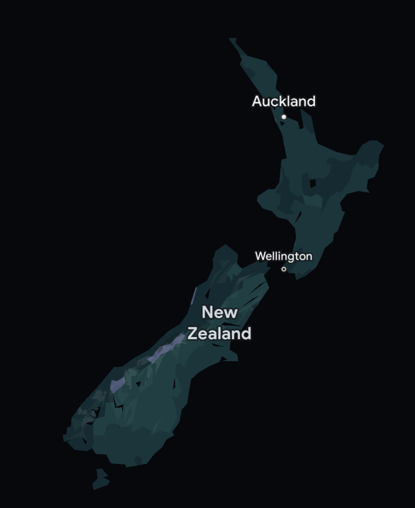

+++
title = "Tiled Maps"
date = 2023-06-16T18:12:59-07:00
description = "How maps work on the web"
[taxonomies]
tags = ["maps"]
+++

Tiled maps divide the globe into a grid of squares. Each tile is a 256x256 raster image defined by 3 variables: zoom (z), x, and y. At zoom 0, the globe is represented by a single tile. Increasing the zoom by 1 divides each tile into 4 additional tiles, affording greater detail. Zoom usually does not go beyond 22, at which point tiles are much smaller than a city block.

*Zooming in on Seattle from level 11 to level 19 using [OpenStreetMap](https://www.openstreetmap.org). &Copy; OpenStreetMap Contributors*

These tiles are created using rendering software like [Mapnik](https://wiki.openstreetmap.org/wiki/Mapnik). Since tiles are static images, they can be served with a [CDN](https://en.wikipedia.org/wiki/Content_delivery_network). Tiles at low zoom can easily be generated ahead of time, but at zoom 18 there are over 68 billion tiles. Most tile servers render tiles at zoom 12+ on the fly and cache them. This works quite well since users tend to zoom in on populous areas where tiles have already been generated. It's unlikely that anyone will zoom in on an arbitrary patch of the ocean.

On the client side, a mapping library like [Leaflet](https://leafletjs.com/) fetches tiles and stitches them together to display the map. For example, a few tiles can be stitched together to show [Mercer Island, WA](https://en.wikipedia.org/wiki/Mercer_Island,_Washington) and the vicinity:

*Upper left tile is the same one we saw at zoom level 12 earlier. &Copy; OpenStreetMap Contributors*

Tiles are fetched based on the bounding box the user is looking at and the current zoom level. Let's say we wanted to view the Space Needle on OpenStreetMap at zoom 19. OSM uses the [WGS84](https://en.wikipedia.org/wiki/World_Geodetic_System#WGS84) projection for coordinates and places the Space Needle at a latitude and longitude of `47.62049, -122.34928`. We convert these coordinates to the [Web Mercator](https://en.wikipedia.org/wiki/Web_Mercator_projection) projection used by tile servers, and using the zoom derive integer coordinates for the tile to fetch.

$$
lat := 47.62049\\\\
lon := -122.34928\\\\
z := 19\\\\
x := \frac{lon}{360} + \frac{1}{2} = 0.160141\\\\
lat_{sin} := \sin(lat * \frac{\pi}{180})\\\\
y := \frac{1}{2} - \frac{1}{4\pi} * \log(\frac{1 + lat_{sin}} {1 - lat_{sin}}) = 0.349184\\\\
y_{tile} := \lfloor yz^{2} \rfloor = 183073\\\\
x_{tile} := \lfloor xz^{2} \rfloor = 83959\\\\
\\\\
$$

So if we fetch the tile at zoom 19, x 83959, and y 183073, we get the Space Needle:

*&Copy; OpenStreetMap Contributors*

Or, at least the lower left corner of it.

## Vector Tiles

Tiles are traditionally *rasterized*, which presents some challenges:

* Screen readers cannot make sense of the map, so they are not accessible at all
* Zooming in on a map while offline simply shows a more blurry map or no map at all
* When the map is rotated, labels remain at their original orientation and are harder to read
* For application-specific maps, we may want to hide/display additional features (i.e. contour lines) which would require an entirely separate set of tiles

Problems like these have led to the rise of *vector* tiles. Vector tiles use the same general strategy of dividing up the globe, but the rendering technique is quite different. Tiles contain information about features in area and the client is responsible for displaying them. At low zoom, many features are excluded from tiles. Small but visible geometries are simplified to reduce tile size and speed up client-side rendering. Google Maps is a prominent mapping software that uses vector tiles. Below is the simplified representation of New Zealand available while offline:

*Map data &Copy;2023 Google, INEGI*
