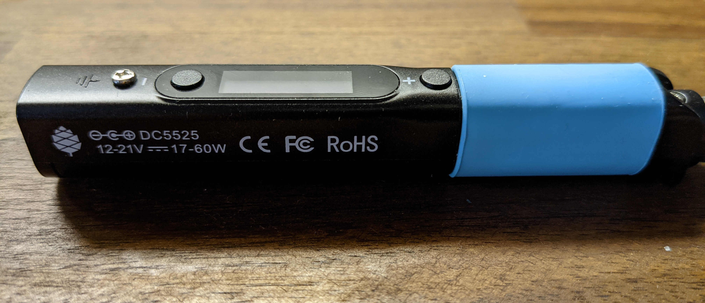
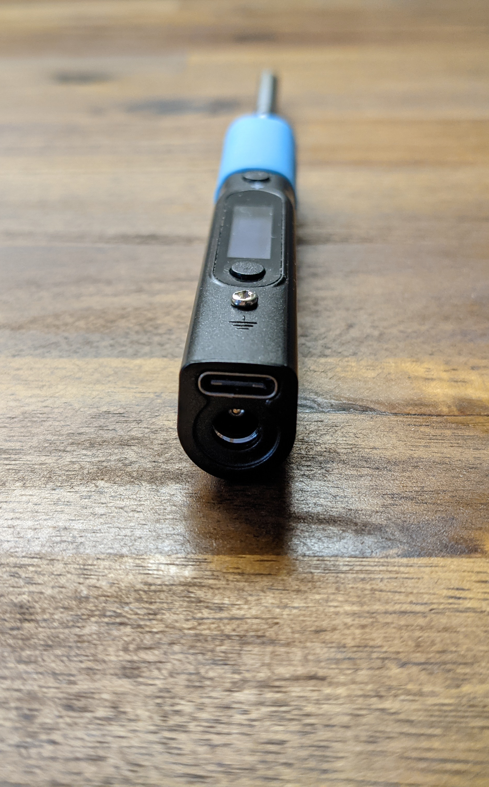
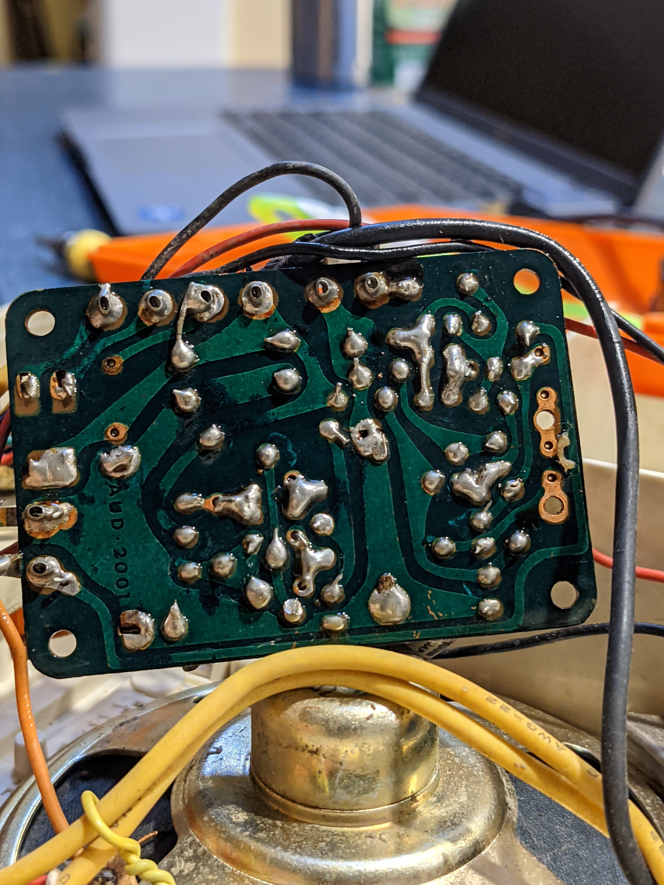

+++
title = "Pinecil a USB-C soldering iron"
date = 2021-08-01T15:36:42-04:00
description = "About the Pinecil, a USB-C soldering iron way better than its competition"
[taxonomies]
tags = ["electronics"]
+++

I finally received my [Pinecil](https://pine64.com/product/pinecil-smart-mini-portable-soldering-iron/) soldering iron last week.
It's a really good product so I think it's worth writing about.

## Description

The Pinecil is a portable soldering iron powered by DC barrel jack or USB-C.
Tip temperature can be accurately controlled after some calibration.
The tips have integrated heating elements and can be easily swapped depending on your use case.
Some sort of [IMU](https://en.wikipedia.org/wiki/Inertial_measurement_unit) controls screen orientation and ensures safety with automatic snooze + shutdown.

Clearly, the Pinecil was heavily inspired by the TS100 which was [available even back in 2017](https://hackaday.com/2017/07/24/review-ts100-soldering-iron/):

*Jenny List from Hackaday*

### Comparison

I've compared the Pinecil with other portable irons below:

||Hakko FX-901|TS100|TS80P|Pinecil|
|--|--|--|--|--|
|Power supply|4 AA Batteries|barrel jack|USB-C / barrel jack|USB-C / barrel jack|
|Power consumption|6W|:question:|18W|60W|
|Microcontroller|N/A|STM32 (ARM)|STM32 (ARM)|GD32VF103TB (RISCV)|
|Motion sensitive|:x:|:heavy_check_mark:|:heavy_check_mark:|:heavy_check_mark:|
|Open-source firmware|N/A|:ok: (FOSS alternative available)|:ok: (FOSS alternative available)|:heavy_check_mark:|
|PCB schematics|:x:|:x:|:x:|:heavy_check_mark:|
|PCB placement diagrams|:x:|:x:|:x:|:heavy_check_mark:|
|Price|$32.07|~ $70|$109.95|$24.99 (community price)|
|Link|[Hakko](https://www.hakko.com/english/products/hakko_fx901_spec.html)|[Amazon](https://www.amazon.com/s?k=ts100)|[Adafruit](https://www.adafruit.com/product/4244)|[Pine Store](https://pine64.com/product/pinecil-smart-mini-portable-soldering-iron/)|

## Shipping

Standard shipping on the Pine64 Store is $11.99 USD so I thought it might arrive quickly. Little did I know that it would take four months :upside_down_face:.

The tracking info showed that the package was redirected multiple times in Shenzhen. I was mildly concerned but chalked it up to a combination of COVID-19 conditions and increased volume.
However at the two month mark, I was left with the dreaded text `2021-06-10 19:00 United States, overseas import cancellation`. Shortly after that the tracking number actually expired and there were no more updates.
I can only conclude that it got lost at customs.

I reached out to The Pine64 team and they were kind enough to send me a second one. To their credit, this package took only 20 days to arrive. The box was a bit roughed up but the Pinecil was perfectly fine.

## Review

### Getting Started

There are no instructions in the box nor any on the [Pinecil's store page](https://pine64.com/product/pinecil-smart-mini-portable-soldering-iron/) but I found the GitHub repo for [IronOS](https://github.com/Ralim/IronOS), the Pinecil's firmware.
Through that I discovered that there is a [Pinecil wiki page](https://wiki.pine64.org/wiki/Pinecil)... :facepalm:

### Repair Job

With setup out of the way I used it in repairing a really old record player. The PCB traces looked quite different from anything I've seen before:

I used my laptop's USB-C charger to power the Pinecil. It heats up *really fast*. The tip conducts well and the solder melts quickly. There is some hysteresis near the target temperature but it stabilizes after a bit.

The only issue I had was some awkwardness with positioning the iron when not in use.
The [mini stand](https://pine64.com/product/pinecil-portable-mini-stand/) provided a place to rest the Pinecil without damaging my table. However, I was worried the entire time about pulling on the cable and dropping the iron. I plan to design and 3D print my own more secure stand (inspired by the [Hakko FM-2027](https://hakkousa.com/products/soldering/soldering-irons/fm-2027-soldering-iron-handpiece-kit.html)'s secure mounting stand).

## Closing thoughts

The biggest takeaway from my experience with the Pinecil is that USB-C is *the future*.
For the first time in electronics, we have a standard, reversible connector for delivering power, transferring data, and a variety of other auxiliary functions.
USB-C was first adopted in smartphones, then laptops, and only recently in select small footprint electronics like power banks and single-board computers.
Continuing this trend, I expect more traditional devices to be USB-C enabled very soon.
Imagine a power drill with USB-C connectivity: you would have the freedom to power it from the grid, a battery pack of your choice, or even your phone!

It goes without saying that the Pine64 team and community have created an impressive product.
Rough edges aside, there's no question that it beats the competition.
Even more surprising is that the Pinecil's PCB designs, schematics, and firmware are all openly available.
The iron is extensible, easy to repair, and backed by a large community.
I'm really looking forward to see what Pine64 releases next!
